**30E03000 - Data Science for Business I (2021)**


```python

```

# Tutorial 2: Predicting customer response to marketing campaigns


### Business Problem

Our company is running several advertising campaigns. While the marketing department is happily spending money, our team of business analysts has been asked whether a data-driven model could help to target customers more efficiently and reduce wasteful advertising spending. 
Sure we can: **our goal is to build a classification model that can predict a customer's response to a specific advertising campaign based on basic customer information (gender, age, income, etc.).** Ideally, our model would be able to state for example "do not target customers with an income below 50,000 with ad campaign 2". 

### Learning goals

In this exercise, you will learn how to predict customer responses to marketing compaigns. Specifically, we will cover:
- Building **logistic regression** and Support Vector Machine (**SVM**) models
- **Rebalancing** imbalanced data 
- Evaluating and visualizing model performance through different measures
- Using performance metrices to compare alternative models


### Keywords

`classification`, `logistic regression`, `SVM`, `rebalancing`, `model evaluation`

## Import libraries 


```python
import pandas as pd #data frames (for storing data)
import numpy as np #scientific computing
import itertools

#matplotlib for plotting
import matplotlib.pyplot as plt
from matplotlib import gridspec
import matplotlib.ticker as mtick #for percentage ticks
import scikitplot as skplt 

from sklearn.svm import SVC
from sklearn.linear_model import LogisticRegression

from sklearn.model_selection import train_test_split #Data split function
from imblearn.over_sampling import SMOTE
from sklearn.decomposition import PCA

from sklearn.metrics import accuracy_score
from sklearn.metrics import confusion_matrix
from sklearn.metrics import roc_curve, auc

from collections import Counter
```

    Using TensorFlow backend.


## 1. Load data


```python
data = pd.read_csv('CustomerResponseData.csv')
data.head(10).style #add .style to show all columns (otherwise some columns will be hidden with "...")
```


<style  type="text/css" >
</style><table id="T_64266554_75f9_11eb_bede_59294dbcc0a8" ><thead>    <tr>        <th class="blank level0" ></th>        <th class="col_heading level0 col0" >customer_id</th>        <th class="col_heading level0 col1" >campaign</th>        <th class="col_heading level0 col2" >response</th>        <th class="col_heading level0 col3" >response_date</th>        <th class="col_heading level0 col4" >purchase</th>        <th class="col_heading level0 col5" >purchase_date</th>        <th class="col_heading level0 col6" >product_id</th>        <th class="col_heading level0 col7" >Rowid</th>        <th class="col_heading level0 col8" >age</th>        <th class="col_heading level0 col9" >age_youngest_child</th>        <th class="col_heading level0 col10" >average#balance#feed#index</th>        <th class="col_heading level0 col11" >branch</th>        <th class="col_heading level0 col12" >debt_equity</th>        <th class="col_heading level0 col13" >gender</th>        <th class="col_heading level0 col14" >bad_payment</th>        <th class="col_heading level0 col15" >gold_card</th>        <th class="col_heading level0 col16" >pension_plan</th>        <th class="col_heading level0 col17" >household_debt_to_equity_ratio</th>        <th class="col_heading level0 col18" >income</th>        <th class="col_heading level0 col19" >marital</th>        <th class="col_heading level0 col20" >members_in_household</th>        <th class="col_heading level0 col21" >months_current_account</th>        <th class="col_heading level0 col22" >months_customer</th>        <th class="col_heading level0 col23" >call_center_contacts</th>        <th class="col_heading level0 col24" >loan_accounts</th>        <th class="col_heading level0 col25" >number_products</th>        <th class="col_heading level0 col26" >number_transactions</th>        <th class="col_heading level0 col27" >non_worker_percentage</th>        <th class="col_heading level0 col28" >white_collar_percentage</th>        <th class="col_heading level0 col29" >rfm_score</th>        <th class="col_heading level0 col30" >X_random</th>    </tr></thead><tbody>
                <tr>
                        <th id="T_64266554_75f9_11eb_bede_59294dbcc0a8level0_row0" class="row_heading level0 row0" >0</th>
                        <td id="T_64266554_75f9_11eb_bede_59294dbcc0a8row0_col0" class="data row0 col0" >7</td>
                        <td id="T_64266554_75f9_11eb_bede_59294dbcc0a8row0_col1" class="data row0 col1" >2</td>
                        <td id="T_64266554_75f9_11eb_bede_59294dbcc0a8row0_col2" class="data row0 col2" >0</td>
                        <td id="T_64266554_75f9_11eb_bede_59294dbcc0a8row0_col3" class="data row0 col3" > </td>
                        <td id="T_64266554_75f9_11eb_bede_59294dbcc0a8row0_col4" class="data row0 col4" >0</td>
                        <td id="T_64266554_75f9_11eb_bede_59294dbcc0a8row0_col5" class="data row0 col5" > </td>
                        <td id="T_64266554_75f9_11eb_bede_59294dbcc0a8row0_col6" class="data row0 col6" > </td>
                        <td id="T_64266554_75f9_11eb_bede_59294dbcc0a8row0_col7" class="data row0 col7" >1</td>
                        <td id="T_64266554_75f9_11eb_bede_59294dbcc0a8row0_col8" class="data row0 col8" >19</td>
                        <td id="T_64266554_75f9_11eb_bede_59294dbcc0a8row0_col9" class="data row0 col9" >0</td>
                        <td id="T_64266554_75f9_11eb_bede_59294dbcc0a8row0_col10" class="data row0 col10" >0</td>
                        <td id="T_64266554_75f9_11eb_bede_59294dbcc0a8row0_col11" class="data row0 col11" >Ravensville</td>
                        <td id="T_64266554_75f9_11eb_bede_59294dbcc0a8row0_col12" class="data row0 col12" >19</td>
                        <td id="T_64266554_75f9_11eb_bede_59294dbcc0a8row0_col13" class="data row0 col13" >M</td>
                        <td id="T_64266554_75f9_11eb_bede_59294dbcc0a8row0_col14" class="data row0 col14" >0</td>
                        <td id="T_64266554_75f9_11eb_bede_59294dbcc0a8row0_col15" class="data row0 col15" >0</td>
                        <td id="T_64266554_75f9_11eb_bede_59294dbcc0a8row0_col16" class="data row0 col16" >0</td>
                        <td id="T_64266554_75f9_11eb_bede_59294dbcc0a8row0_col17" class="data row0 col17" >64</td>
                        <td id="T_64266554_75f9_11eb_bede_59294dbcc0a8row0_col18" class="data row0 col18" >13362</td>
                        <td id="T_64266554_75f9_11eb_bede_59294dbcc0a8row0_col19" class="data row0 col19" >S</td>
                        <td id="T_64266554_75f9_11eb_bede_59294dbcc0a8row0_col20" class="data row0 col20" >2</td>
                        <td id="T_64266554_75f9_11eb_bede_59294dbcc0a8row0_col21" class="data row0 col21" >-4</td>
                        <td id="T_64266554_75f9_11eb_bede_59294dbcc0a8row0_col22" class="data row0 col22" >0</td>
                        <td id="T_64266554_75f9_11eb_bede_59294dbcc0a8row0_col23" class="data row0 col23" >1</td>
                        <td id="T_64266554_75f9_11eb_bede_59294dbcc0a8row0_col24" class="data row0 col24" >1</td>
                        <td id="T_64266554_75f9_11eb_bede_59294dbcc0a8row0_col25" class="data row0 col25" >1</td>
                        <td id="T_64266554_75f9_11eb_bede_59294dbcc0a8row0_col26" class="data row0 col26" >0</td>
                        <td id="T_64266554_75f9_11eb_bede_59294dbcc0a8row0_col27" class="data row0 col27" >9</td>
                        <td id="T_64266554_75f9_11eb_bede_59294dbcc0a8row0_col28" class="data row0 col28" >26</td>
                        <td id="T_64266554_75f9_11eb_bede_59294dbcc0a8row0_col29" class="data row0 col29" >0</td>
                        <td id="T_64266554_75f9_11eb_bede_59294dbcc0a8row0_col30" class="data row0 col30" >3</td>
            </tr>
            <tr>
                        <th id="T_64266554_75f9_11eb_bede_59294dbcc0a8level0_row1" class="row_heading level0 row1" >1</th>
                        <td id="T_64266554_75f9_11eb_bede_59294dbcc0a8row1_col0" class="data row1 col0" >13</td>
                        <td id="T_64266554_75f9_11eb_bede_59294dbcc0a8row1_col1" class="data row1 col1" >2</td>
                        <td id="T_64266554_75f9_11eb_bede_59294dbcc0a8row1_col2" class="data row1 col2" >0</td>
                        <td id="T_64266554_75f9_11eb_bede_59294dbcc0a8row1_col3" class="data row1 col3" > </td>
                        <td id="T_64266554_75f9_11eb_bede_59294dbcc0a8row1_col4" class="data row1 col4" >0</td>
                        <td id="T_64266554_75f9_11eb_bede_59294dbcc0a8row1_col5" class="data row1 col5" > </td>
                        <td id="T_64266554_75f9_11eb_bede_59294dbcc0a8row1_col6" class="data row1 col6" > </td>
                        <td id="T_64266554_75f9_11eb_bede_59294dbcc0a8row1_col7" class="data row1 col7" >2</td>
                        <td id="T_64266554_75f9_11eb_bede_59294dbcc0a8row1_col8" class="data row1 col8" >44</td>
                        <td id="T_64266554_75f9_11eb_bede_59294dbcc0a8row1_col9" class="data row1 col9" >12</td>
                        <td id="T_64266554_75f9_11eb_bede_59294dbcc0a8row1_col10" class="data row1 col10" >0</td>
                        <td id="T_64266554_75f9_11eb_bede_59294dbcc0a8row1_col11" class="data row1 col11" >Catburg</td>
                        <td id="T_64266554_75f9_11eb_bede_59294dbcc0a8row1_col12" class="data row1 col12" >44</td>
                        <td id="T_64266554_75f9_11eb_bede_59294dbcc0a8row1_col13" class="data row1 col13" >M</td>
                        <td id="T_64266554_75f9_11eb_bede_59294dbcc0a8row1_col14" class="data row1 col14" >0</td>
                        <td id="T_64266554_75f9_11eb_bede_59294dbcc0a8row1_col15" class="data row1 col15" >0</td>
                        <td id="T_64266554_75f9_11eb_bede_59294dbcc0a8row1_col16" class="data row1 col16" >0</td>
                        <td id="T_64266554_75f9_11eb_bede_59294dbcc0a8row1_col17" class="data row1 col17" >65</td>
                        <td id="T_64266554_75f9_11eb_bede_59294dbcc0a8row1_col18" class="data row1 col18" >13453</td>
                        <td id="T_64266554_75f9_11eb_bede_59294dbcc0a8row1_col19" class="data row1 col19" >S</td>
                        <td id="T_64266554_75f9_11eb_bede_59294dbcc0a8row1_col20" class="data row1 col20" >2</td>
                        <td id="T_64266554_75f9_11eb_bede_59294dbcc0a8row1_col21" class="data row1 col21" >17</td>
                        <td id="T_64266554_75f9_11eb_bede_59294dbcc0a8row1_col22" class="data row1 col22" >24</td>
                        <td id="T_64266554_75f9_11eb_bede_59294dbcc0a8row1_col23" class="data row1 col23" >0</td>
                        <td id="T_64266554_75f9_11eb_bede_59294dbcc0a8row1_col24" class="data row1 col24" >0</td>
                        <td id="T_64266554_75f9_11eb_bede_59294dbcc0a8row1_col25" class="data row1 col25" >0</td>
                        <td id="T_64266554_75f9_11eb_bede_59294dbcc0a8row1_col26" class="data row1 col26" >0</td>
                        <td id="T_64266554_75f9_11eb_bede_59294dbcc0a8row1_col27" class="data row1 col27" >14</td>
                        <td id="T_64266554_75f9_11eb_bede_59294dbcc0a8row1_col28" class="data row1 col28" >19</td>
                        <td id="T_64266554_75f9_11eb_bede_59294dbcc0a8row1_col29" class="data row1 col29" >0</td>
                        <td id="T_64266554_75f9_11eb_bede_59294dbcc0a8row1_col30" class="data row1 col30" >1</td>
            </tr>
            <tr>
                        <th id="T_64266554_75f9_11eb_bede_59294dbcc0a8level0_row2" class="row_heading level0 row2" >2</th>
                        <td id="T_64266554_75f9_11eb_bede_59294dbcc0a8row2_col0" class="data row2 col0" >15</td>
                        <td id="T_64266554_75f9_11eb_bede_59294dbcc0a8row2_col1" class="data row2 col1" >2</td>
                        <td id="T_64266554_75f9_11eb_bede_59294dbcc0a8row2_col2" class="data row2 col2" >0</td>
                        <td id="T_64266554_75f9_11eb_bede_59294dbcc0a8row2_col3" class="data row2 col3" > </td>
                        <td id="T_64266554_75f9_11eb_bede_59294dbcc0a8row2_col4" class="data row2 col4" >0</td>
                        <td id="T_64266554_75f9_11eb_bede_59294dbcc0a8row2_col5" class="data row2 col5" > </td>
                        <td id="T_64266554_75f9_11eb_bede_59294dbcc0a8row2_col6" class="data row2 col6" > </td>
                        <td id="T_64266554_75f9_11eb_bede_59294dbcc0a8row2_col7" class="data row2 col7" >3</td>
                        <td id="T_64266554_75f9_11eb_bede_59294dbcc0a8row2_col8" class="data row2 col8" >45</td>
                        <td id="T_64266554_75f9_11eb_bede_59294dbcc0a8row2_col9" class="data row2 col9" >12</td>
                        <td id="T_64266554_75f9_11eb_bede_59294dbcc0a8row2_col10" class="data row2 col10" >75</td>
                        <td id="T_64266554_75f9_11eb_bede_59294dbcc0a8row2_col11" class="data row2 col11" >Ravensville</td>
                        <td id="T_64266554_75f9_11eb_bede_59294dbcc0a8row2_col12" class="data row2 col12" >45</td>
                        <td id="T_64266554_75f9_11eb_bede_59294dbcc0a8row2_col13" class="data row2 col13" >F</td>
                        <td id="T_64266554_75f9_11eb_bede_59294dbcc0a8row2_col14" class="data row2 col14" >0</td>
                        <td id="T_64266554_75f9_11eb_bede_59294dbcc0a8row2_col15" class="data row2 col15" >0</td>
                        <td id="T_64266554_75f9_11eb_bede_59294dbcc0a8row2_col16" class="data row2 col16" >0</td>
                        <td id="T_64266554_75f9_11eb_bede_59294dbcc0a8row2_col17" class="data row2 col17" >65</td>
                        <td id="T_64266554_75f9_11eb_bede_59294dbcc0a8row2_col18" class="data row2 col18" >13453</td>
                        <td id="T_64266554_75f9_11eb_bede_59294dbcc0a8row2_col19" class="data row2 col19" >U</td>
                        <td id="T_64266554_75f9_11eb_bede_59294dbcc0a8row2_col20" class="data row2 col20" >2</td>
                        <td id="T_64266554_75f9_11eb_bede_59294dbcc0a8row2_col21" class="data row2 col21" >33</td>
                        <td id="T_64266554_75f9_11eb_bede_59294dbcc0a8row2_col22" class="data row2 col22" >36</td>
                        <td id="T_64266554_75f9_11eb_bede_59294dbcc0a8row2_col23" class="data row2 col23" >0</td>
                        <td id="T_64266554_75f9_11eb_bede_59294dbcc0a8row2_col24" class="data row2 col24" >4</td>
                        <td id="T_64266554_75f9_11eb_bede_59294dbcc0a8row2_col25" class="data row2 col25" >2</td>
                        <td id="T_64266554_75f9_11eb_bede_59294dbcc0a8row2_col26" class="data row2 col26" >1</td>
                        <td id="T_64266554_75f9_11eb_bede_59294dbcc0a8row2_col27" class="data row2 col27" >14</td>
                        <td id="T_64266554_75f9_11eb_bede_59294dbcc0a8row2_col28" class="data row2 col28" >19</td>
                        <td id="T_64266554_75f9_11eb_bede_59294dbcc0a8row2_col29" class="data row2 col29" >7.60233</td>
                        <td id="T_64266554_75f9_11eb_bede_59294dbcc0a8row2_col30" class="data row2 col30" >1</td>
            </tr>
            <tr>
                        <th id="T_64266554_75f9_11eb_bede_59294dbcc0a8level0_row3" class="row_heading level0 row3" >3</th>
                        <td id="T_64266554_75f9_11eb_bede_59294dbcc0a8row3_col0" class="data row3 col0" >16</td>
                        <td id="T_64266554_75f9_11eb_bede_59294dbcc0a8row3_col1" class="data row3 col1" >2</td>
                        <td id="T_64266554_75f9_11eb_bede_59294dbcc0a8row3_col2" class="data row3 col2" >1</td>
                        <td id="T_64266554_75f9_11eb_bede_59294dbcc0a8row3_col3" class="data row3 col3" >7/5/2006 0:00:00</td>
                        <td id="T_64266554_75f9_11eb_bede_59294dbcc0a8row3_col4" class="data row3 col4" >0</td>
                        <td id="T_64266554_75f9_11eb_bede_59294dbcc0a8row3_col5" class="data row3 col5" > </td>
                        <td id="T_64266554_75f9_11eb_bede_59294dbcc0a8row3_col6" class="data row3 col6" >183</td>
                        <td id="T_64266554_75f9_11eb_bede_59294dbcc0a8row3_col7" class="data row3 col7" >761</td>
                        <td id="T_64266554_75f9_11eb_bede_59294dbcc0a8row3_col8" class="data row3 col8" >43</td>
                        <td id="T_64266554_75f9_11eb_bede_59294dbcc0a8row3_col9" class="data row3 col9" >12</td>
                        <td id="T_64266554_75f9_11eb_bede_59294dbcc0a8row3_col10" class="data row3 col10" >161</td>
                        <td id="T_64266554_75f9_11eb_bede_59294dbcc0a8row3_col11" class="data row3 col11" >Catburg</td>
                        <td id="T_64266554_75f9_11eb_bede_59294dbcc0a8row3_col12" class="data row3 col12" >43</td>
                        <td id="T_64266554_75f9_11eb_bede_59294dbcc0a8row3_col13" class="data row3 col13" >F</td>
                        <td id="T_64266554_75f9_11eb_bede_59294dbcc0a8row3_col14" class="data row3 col14" >0</td>
                        <td id="T_64266554_75f9_11eb_bede_59294dbcc0a8row3_col15" class="data row3 col15" >0</td>
                        <td id="T_64266554_75f9_11eb_bede_59294dbcc0a8row3_col16" class="data row3 col16" >0</td>
                        <td id="T_64266554_75f9_11eb_bede_59294dbcc0a8row3_col17" class="data row3 col17" >65</td>
                        <td id="T_64266554_75f9_11eb_bede_59294dbcc0a8row3_col18" class="data row3 col18" >13453</td>
                        <td id="T_64266554_75f9_11eb_bede_59294dbcc0a8row3_col19" class="data row3 col19" >U</td>
                        <td id="T_64266554_75f9_11eb_bede_59294dbcc0a8row3_col20" class="data row3 col20" >2</td>
                        <td id="T_64266554_75f9_11eb_bede_59294dbcc0a8row3_col21" class="data row3 col21" >34</td>
                        <td id="T_64266554_75f9_11eb_bede_59294dbcc0a8row3_col22" class="data row3 col22" >36</td>
                        <td id="T_64266554_75f9_11eb_bede_59294dbcc0a8row3_col23" class="data row3 col23" >0</td>
                        <td id="T_64266554_75f9_11eb_bede_59294dbcc0a8row3_col24" class="data row3 col24" >0</td>
                        <td id="T_64266554_75f9_11eb_bede_59294dbcc0a8row3_col25" class="data row3 col25" >3</td>
                        <td id="T_64266554_75f9_11eb_bede_59294dbcc0a8row3_col26" class="data row3 col26" >2</td>
                        <td id="T_64266554_75f9_11eb_bede_59294dbcc0a8row3_col27" class="data row3 col27" >14</td>
                        <td id="T_64266554_75f9_11eb_bede_59294dbcc0a8row3_col28" class="data row3 col28" >19</td>
                        <td id="T_64266554_75f9_11eb_bede_59294dbcc0a8row3_col29" class="data row3 col29" >10.143</td>
                        <td id="T_64266554_75f9_11eb_bede_59294dbcc0a8row3_col30" class="data row3 col30" >1</td>
            </tr>
            <tr>
                        <th id="T_64266554_75f9_11eb_bede_59294dbcc0a8level0_row4" class="row_heading level0 row4" >4</th>
                        <td id="T_64266554_75f9_11eb_bede_59294dbcc0a8row4_col0" class="data row4 col0" >23</td>
                        <td id="T_64266554_75f9_11eb_bede_59294dbcc0a8row4_col1" class="data row4 col1" >2</td>
                        <td id="T_64266554_75f9_11eb_bede_59294dbcc0a8row4_col2" class="data row4 col2" >0</td>
                        <td id="T_64266554_75f9_11eb_bede_59294dbcc0a8row4_col3" class="data row4 col3" > </td>
                        <td id="T_64266554_75f9_11eb_bede_59294dbcc0a8row4_col4" class="data row4 col4" >0</td>
                        <td id="T_64266554_75f9_11eb_bede_59294dbcc0a8row4_col5" class="data row4 col5" > </td>
                        <td id="T_64266554_75f9_11eb_bede_59294dbcc0a8row4_col6" class="data row4 col6" > </td>
                        <td id="T_64266554_75f9_11eb_bede_59294dbcc0a8row4_col7" class="data row4 col7" >4</td>
                        <td id="T_64266554_75f9_11eb_bede_59294dbcc0a8row4_col8" class="data row4 col8" >42</td>
                        <td id="T_64266554_75f9_11eb_bede_59294dbcc0a8row4_col9" class="data row4 col9" >11</td>
                        <td id="T_64266554_75f9_11eb_bede_59294dbcc0a8row4_col10" class="data row4 col10" >0</td>
                        <td id="T_64266554_75f9_11eb_bede_59294dbcc0a8row4_col11" class="data row4 col11" >Kingsville</td>
                        <td id="T_64266554_75f9_11eb_bede_59294dbcc0a8row4_col12" class="data row4 col12" >42</td>
                        <td id="T_64266554_75f9_11eb_bede_59294dbcc0a8row4_col13" class="data row4 col13" >F</td>
                        <td id="T_64266554_75f9_11eb_bede_59294dbcc0a8row4_col14" class="data row4 col14" >0</td>
                        <td id="T_64266554_75f9_11eb_bede_59294dbcc0a8row4_col15" class="data row4 col15" >0</td>
                        <td id="T_64266554_75f9_11eb_bede_59294dbcc0a8row4_col16" class="data row4 col16" >0</td>
                        <td id="T_64266554_75f9_11eb_bede_59294dbcc0a8row4_col17" class="data row4 col17" >65</td>
                        <td id="T_64266554_75f9_11eb_bede_59294dbcc0a8row4_col18" class="data row4 col18" >13453</td>
                        <td id="T_64266554_75f9_11eb_bede_59294dbcc0a8row4_col19" class="data row4 col19" >M</td>
                        <td id="T_64266554_75f9_11eb_bede_59294dbcc0a8row4_col20" class="data row4 col20" >2</td>
                        <td id="T_64266554_75f9_11eb_bede_59294dbcc0a8row4_col21" class="data row4 col21" >22</td>
                        <td id="T_64266554_75f9_11eb_bede_59294dbcc0a8row4_col22" class="data row4 col22" >24</td>
                        <td id="T_64266554_75f9_11eb_bede_59294dbcc0a8row4_col23" class="data row4 col23" >0</td>
                        <td id="T_64266554_75f9_11eb_bede_59294dbcc0a8row4_col24" class="data row4 col24" >0</td>
                        <td id="T_64266554_75f9_11eb_bede_59294dbcc0a8row4_col25" class="data row4 col25" >0</td>
                        <td id="T_64266554_75f9_11eb_bede_59294dbcc0a8row4_col26" class="data row4 col26" >0</td>
                        <td id="T_64266554_75f9_11eb_bede_59294dbcc0a8row4_col27" class="data row4 col27" >14</td>
                        <td id="T_64266554_75f9_11eb_bede_59294dbcc0a8row4_col28" class="data row4 col28" >19</td>
                        <td id="T_64266554_75f9_11eb_bede_59294dbcc0a8row4_col29" class="data row4 col29" >0</td>
                        <td id="T_64266554_75f9_11eb_bede_59294dbcc0a8row4_col30" class="data row4 col30" >3</td>
            </tr>
            <tr>
                        <th id="T_64266554_75f9_11eb_bede_59294dbcc0a8level0_row5" class="row_heading level0 row5" >5</th>
                        <td id="T_64266554_75f9_11eb_bede_59294dbcc0a8row5_col0" class="data row5 col0" >24</td>
                        <td id="T_64266554_75f9_11eb_bede_59294dbcc0a8row5_col1" class="data row5 col1" >2</td>
                        <td id="T_64266554_75f9_11eb_bede_59294dbcc0a8row5_col2" class="data row5 col2" >0</td>
                        <td id="T_64266554_75f9_11eb_bede_59294dbcc0a8row5_col3" class="data row5 col3" > </td>
                        <td id="T_64266554_75f9_11eb_bede_59294dbcc0a8row5_col4" class="data row5 col4" >0</td>
                        <td id="T_64266554_75f9_11eb_bede_59294dbcc0a8row5_col5" class="data row5 col5" > </td>
                        <td id="T_64266554_75f9_11eb_bede_59294dbcc0a8row5_col6" class="data row5 col6" > </td>
                        <td id="T_64266554_75f9_11eb_bede_59294dbcc0a8row5_col7" class="data row5 col7" >5</td>
                        <td id="T_64266554_75f9_11eb_bede_59294dbcc0a8row5_col8" class="data row5 col8" >39</td>
                        <td id="T_64266554_75f9_11eb_bede_59294dbcc0a8row5_col9" class="data row5 col9" >7</td>
                        <td id="T_64266554_75f9_11eb_bede_59294dbcc0a8row5_col10" class="data row5 col10" >521</td>
                        <td id="T_64266554_75f9_11eb_bede_59294dbcc0a8row5_col11" class="data row5 col11" >Princeton</td>
                        <td id="T_64266554_75f9_11eb_bede_59294dbcc0a8row5_col12" class="data row5 col12" >39</td>
                        <td id="T_64266554_75f9_11eb_bede_59294dbcc0a8row5_col13" class="data row5 col13" >F</td>
                        <td id="T_64266554_75f9_11eb_bede_59294dbcc0a8row5_col14" class="data row5 col14" >0</td>
                        <td id="T_64266554_75f9_11eb_bede_59294dbcc0a8row5_col15" class="data row5 col15" >0</td>
                        <td id="T_64266554_75f9_11eb_bede_59294dbcc0a8row5_col16" class="data row5 col16" >0</td>
                        <td id="T_64266554_75f9_11eb_bede_59294dbcc0a8row5_col17" class="data row5 col17" >65</td>
                        <td id="T_64266554_75f9_11eb_bede_59294dbcc0a8row5_col18" class="data row5 col18" >13453</td>
                        <td id="T_64266554_75f9_11eb_bede_59294dbcc0a8row5_col19" class="data row5 col19" >S</td>
                        <td id="T_64266554_75f9_11eb_bede_59294dbcc0a8row5_col20" class="data row5 col20" >2</td>
                        <td id="T_64266554_75f9_11eb_bede_59294dbcc0a8row5_col21" class="data row5 col21" >26</td>
                        <td id="T_64266554_75f9_11eb_bede_59294dbcc0a8row5_col22" class="data row5 col22" >36</td>
                        <td id="T_64266554_75f9_11eb_bede_59294dbcc0a8row5_col23" class="data row5 col23" >0</td>
                        <td id="T_64266554_75f9_11eb_bede_59294dbcc0a8row5_col24" class="data row5 col24" >0</td>
                        <td id="T_64266554_75f9_11eb_bede_59294dbcc0a8row5_col25" class="data row5 col25" >0</td>
                        <td id="T_64266554_75f9_11eb_bede_59294dbcc0a8row5_col26" class="data row5 col26" >3</td>
                        <td id="T_64266554_75f9_11eb_bede_59294dbcc0a8row5_col27" class="data row5 col27" >14</td>
                        <td id="T_64266554_75f9_11eb_bede_59294dbcc0a8row5_col28" class="data row5 col28" >19</td>
                        <td id="T_64266554_75f9_11eb_bede_59294dbcc0a8row5_col29" class="data row5 col29" >9.85432</td>
                        <td id="T_64266554_75f9_11eb_bede_59294dbcc0a8row5_col30" class="data row5 col30" >2</td>
            </tr>
            <tr>
                        <th id="T_64266554_75f9_11eb_bede_59294dbcc0a8level0_row6" class="row_heading level0 row6" >6</th>
                        <td id="T_64266554_75f9_11eb_bede_59294dbcc0a8row6_col0" class="data row6 col0" >30</td>
                        <td id="T_64266554_75f9_11eb_bede_59294dbcc0a8row6_col1" class="data row6 col1" >2</td>
                        <td id="T_64266554_75f9_11eb_bede_59294dbcc0a8row6_col2" class="data row6 col2" >0</td>
                        <td id="T_64266554_75f9_11eb_bede_59294dbcc0a8row6_col3" class="data row6 col3" > </td>
                        <td id="T_64266554_75f9_11eb_bede_59294dbcc0a8row6_col4" class="data row6 col4" >0</td>
                        <td id="T_64266554_75f9_11eb_bede_59294dbcc0a8row6_col5" class="data row6 col5" > </td>
                        <td id="T_64266554_75f9_11eb_bede_59294dbcc0a8row6_col6" class="data row6 col6" > </td>
                        <td id="T_64266554_75f9_11eb_bede_59294dbcc0a8row6_col7" class="data row6 col7" >6</td>
                        <td id="T_64266554_75f9_11eb_bede_59294dbcc0a8row6_col8" class="data row6 col8" >23</td>
                        <td id="T_64266554_75f9_11eb_bede_59294dbcc0a8row6_col9" class="data row6 col9" >0</td>
                        <td id="T_64266554_75f9_11eb_bede_59294dbcc0a8row6_col10" class="data row6 col10" >0</td>
                        <td id="T_64266554_75f9_11eb_bede_59294dbcc0a8row6_col11" class="data row6 col11" >Princeton</td>
                        <td id="T_64266554_75f9_11eb_bede_59294dbcc0a8row6_col12" class="data row6 col12" >23</td>
                        <td id="T_64266554_75f9_11eb_bede_59294dbcc0a8row6_col13" class="data row6 col13" >F</td>
                        <td id="T_64266554_75f9_11eb_bede_59294dbcc0a8row6_col14" class="data row6 col14" >0</td>
                        <td id="T_64266554_75f9_11eb_bede_59294dbcc0a8row6_col15" class="data row6 col15" >0</td>
                        <td id="T_64266554_75f9_11eb_bede_59294dbcc0a8row6_col16" class="data row6 col16" >0</td>
                        <td id="T_64266554_75f9_11eb_bede_59294dbcc0a8row6_col17" class="data row6 col17" >65</td>
                        <td id="T_64266554_75f9_11eb_bede_59294dbcc0a8row6_col18" class="data row6 col18" >13453</td>
                        <td id="T_64266554_75f9_11eb_bede_59294dbcc0a8row6_col19" class="data row6 col19" >S</td>
                        <td id="T_64266554_75f9_11eb_bede_59294dbcc0a8row6_col20" class="data row6 col20" >2</td>
                        <td id="T_64266554_75f9_11eb_bede_59294dbcc0a8row6_col21" class="data row6 col21" >30</td>
                        <td id="T_64266554_75f9_11eb_bede_59294dbcc0a8row6_col22" class="data row6 col22" >36</td>
                        <td id="T_64266554_75f9_11eb_bede_59294dbcc0a8row6_col23" class="data row6 col23" >0</td>
                        <td id="T_64266554_75f9_11eb_bede_59294dbcc0a8row6_col24" class="data row6 col24" >1</td>
                        <td id="T_64266554_75f9_11eb_bede_59294dbcc0a8row6_col25" class="data row6 col25" >0</td>
                        <td id="T_64266554_75f9_11eb_bede_59294dbcc0a8row6_col26" class="data row6 col26" >0</td>
                        <td id="T_64266554_75f9_11eb_bede_59294dbcc0a8row6_col27" class="data row6 col27" >14</td>
                        <td id="T_64266554_75f9_11eb_bede_59294dbcc0a8row6_col28" class="data row6 col28" >19</td>
                        <td id="T_64266554_75f9_11eb_bede_59294dbcc0a8row6_col29" class="data row6 col29" >0</td>
                        <td id="T_64266554_75f9_11eb_bede_59294dbcc0a8row6_col30" class="data row6 col30" >1</td>
            </tr>
            <tr>
                        <th id="T_64266554_75f9_11eb_bede_59294dbcc0a8level0_row7" class="row_heading level0 row7" >7</th>
                        <td id="T_64266554_75f9_11eb_bede_59294dbcc0a8row7_col0" class="data row7 col0" >30</td>
                        <td id="T_64266554_75f9_11eb_bede_59294dbcc0a8row7_col1" class="data row7 col1" >3</td>
                        <td id="T_64266554_75f9_11eb_bede_59294dbcc0a8row7_col2" class="data row7 col2" >0</td>
                        <td id="T_64266554_75f9_11eb_bede_59294dbcc0a8row7_col3" class="data row7 col3" > </td>
                        <td id="T_64266554_75f9_11eb_bede_59294dbcc0a8row7_col4" class="data row7 col4" >0</td>
                        <td id="T_64266554_75f9_11eb_bede_59294dbcc0a8row7_col5" class="data row7 col5" > </td>
                        <td id="T_64266554_75f9_11eb_bede_59294dbcc0a8row7_col6" class="data row7 col6" > </td>
                        <td id="T_64266554_75f9_11eb_bede_59294dbcc0a8row7_col7" class="data row7 col7" >7</td>
                        <td id="T_64266554_75f9_11eb_bede_59294dbcc0a8row7_col8" class="data row7 col8" >23</td>
                        <td id="T_64266554_75f9_11eb_bede_59294dbcc0a8row7_col9" class="data row7 col9" >0</td>
                        <td id="T_64266554_75f9_11eb_bede_59294dbcc0a8row7_col10" class="data row7 col10" >0</td>
                        <td id="T_64266554_75f9_11eb_bede_59294dbcc0a8row7_col11" class="data row7 col11" >Princeton</td>
                        <td id="T_64266554_75f9_11eb_bede_59294dbcc0a8row7_col12" class="data row7 col12" >23</td>
                        <td id="T_64266554_75f9_11eb_bede_59294dbcc0a8row7_col13" class="data row7 col13" >F</td>
                        <td id="T_64266554_75f9_11eb_bede_59294dbcc0a8row7_col14" class="data row7 col14" >0</td>
                        <td id="T_64266554_75f9_11eb_bede_59294dbcc0a8row7_col15" class="data row7 col15" >0</td>
                        <td id="T_64266554_75f9_11eb_bede_59294dbcc0a8row7_col16" class="data row7 col16" >0</td>
                        <td id="T_64266554_75f9_11eb_bede_59294dbcc0a8row7_col17" class="data row7 col17" >65</td>
                        <td id="T_64266554_75f9_11eb_bede_59294dbcc0a8row7_col18" class="data row7 col18" >13453</td>
                        <td id="T_64266554_75f9_11eb_bede_59294dbcc0a8row7_col19" class="data row7 col19" >S</td>
                        <td id="T_64266554_75f9_11eb_bede_59294dbcc0a8row7_col20" class="data row7 col20" >2</td>
                        <td id="T_64266554_75f9_11eb_bede_59294dbcc0a8row7_col21" class="data row7 col21" >30</td>
                        <td id="T_64266554_75f9_11eb_bede_59294dbcc0a8row7_col22" class="data row7 col22" >36</td>
                        <td id="T_64266554_75f9_11eb_bede_59294dbcc0a8row7_col23" class="data row7 col23" >0</td>
                        <td id="T_64266554_75f9_11eb_bede_59294dbcc0a8row7_col24" class="data row7 col24" >1</td>
                        <td id="T_64266554_75f9_11eb_bede_59294dbcc0a8row7_col25" class="data row7 col25" >0</td>
                        <td id="T_64266554_75f9_11eb_bede_59294dbcc0a8row7_col26" class="data row7 col26" >0</td>
                        <td id="T_64266554_75f9_11eb_bede_59294dbcc0a8row7_col27" class="data row7 col27" >14</td>
                        <td id="T_64266554_75f9_11eb_bede_59294dbcc0a8row7_col28" class="data row7 col28" >19</td>
                        <td id="T_64266554_75f9_11eb_bede_59294dbcc0a8row7_col29" class="data row7 col29" >0</td>
                        <td id="T_64266554_75f9_11eb_bede_59294dbcc0a8row7_col30" class="data row7 col30" >1</td>
            </tr>
            <tr>
                        <th id="T_64266554_75f9_11eb_bede_59294dbcc0a8level0_row8" class="row_heading level0 row8" >8</th>
                        <td id="T_64266554_75f9_11eb_bede_59294dbcc0a8row8_col0" class="data row8 col0" >33</td>
                        <td id="T_64266554_75f9_11eb_bede_59294dbcc0a8row8_col1" class="data row8 col1" >2</td>
                        <td id="T_64266554_75f9_11eb_bede_59294dbcc0a8row8_col2" class="data row8 col2" >0</td>
                        <td id="T_64266554_75f9_11eb_bede_59294dbcc0a8row8_col3" class="data row8 col3" > </td>
                        <td id="T_64266554_75f9_11eb_bede_59294dbcc0a8row8_col4" class="data row8 col4" >0</td>
                        <td id="T_64266554_75f9_11eb_bede_59294dbcc0a8row8_col5" class="data row8 col5" > </td>
                        <td id="T_64266554_75f9_11eb_bede_59294dbcc0a8row8_col6" class="data row8 col6" > </td>
                        <td id="T_64266554_75f9_11eb_bede_59294dbcc0a8row8_col7" class="data row8 col7" >8</td>
                        <td id="T_64266554_75f9_11eb_bede_59294dbcc0a8row8_col8" class="data row8 col8" >24</td>
                        <td id="T_64266554_75f9_11eb_bede_59294dbcc0a8row8_col9" class="data row8 col9" >0</td>
                        <td id="T_64266554_75f9_11eb_bede_59294dbcc0a8row8_col10" class="data row8 col10" >0</td>
                        <td id="T_64266554_75f9_11eb_bede_59294dbcc0a8row8_col11" class="data row8 col11" >Foxton</td>
                        <td id="T_64266554_75f9_11eb_bede_59294dbcc0a8row8_col12" class="data row8 col12" >24</td>
                        <td id="T_64266554_75f9_11eb_bede_59294dbcc0a8row8_col13" class="data row8 col13" >M</td>
                        <td id="T_64266554_75f9_11eb_bede_59294dbcc0a8row8_col14" class="data row8 col14" >0</td>
                        <td id="T_64266554_75f9_11eb_bede_59294dbcc0a8row8_col15" class="data row8 col15" >0</td>
                        <td id="T_64266554_75f9_11eb_bede_59294dbcc0a8row8_col16" class="data row8 col16" >0</td>
                        <td id="T_64266554_75f9_11eb_bede_59294dbcc0a8row8_col17" class="data row8 col17" >65</td>
                        <td id="T_64266554_75f9_11eb_bede_59294dbcc0a8row8_col18" class="data row8 col18" >13453</td>
                        <td id="T_64266554_75f9_11eb_bede_59294dbcc0a8row8_col19" class="data row8 col19" >S</td>
                        <td id="T_64266554_75f9_11eb_bede_59294dbcc0a8row8_col20" class="data row8 col20" >2</td>
                        <td id="T_64266554_75f9_11eb_bede_59294dbcc0a8row8_col21" class="data row8 col21" >-2</td>
                        <td id="T_64266554_75f9_11eb_bede_59294dbcc0a8row8_col22" class="data row8 col22" >0</td>
                        <td id="T_64266554_75f9_11eb_bede_59294dbcc0a8row8_col23" class="data row8 col23" >0</td>
                        <td id="T_64266554_75f9_11eb_bede_59294dbcc0a8row8_col24" class="data row8 col24" >0</td>
                        <td id="T_64266554_75f9_11eb_bede_59294dbcc0a8row8_col25" class="data row8 col25" >0</td>
                        <td id="T_64266554_75f9_11eb_bede_59294dbcc0a8row8_col26" class="data row8 col26" >0</td>
                        <td id="T_64266554_75f9_11eb_bede_59294dbcc0a8row8_col27" class="data row8 col27" >14</td>
                        <td id="T_64266554_75f9_11eb_bede_59294dbcc0a8row8_col28" class="data row8 col28" >19</td>
                        <td id="T_64266554_75f9_11eb_bede_59294dbcc0a8row8_col29" class="data row8 col29" >0</td>
                        <td id="T_64266554_75f9_11eb_bede_59294dbcc0a8row8_col30" class="data row8 col30" >1</td>
            </tr>
            <tr>
                        <th id="T_64266554_75f9_11eb_bede_59294dbcc0a8level0_row9" class="row_heading level0 row9" >9</th>
                        <td id="T_64266554_75f9_11eb_bede_59294dbcc0a8row9_col0" class="data row9 col0" >42</td>
                        <td id="T_64266554_75f9_11eb_bede_59294dbcc0a8row9_col1" class="data row9 col1" >3</td>
                        <td id="T_64266554_75f9_11eb_bede_59294dbcc0a8row9_col2" class="data row9 col2" >0</td>
                        <td id="T_64266554_75f9_11eb_bede_59294dbcc0a8row9_col3" class="data row9 col3" > </td>
                        <td id="T_64266554_75f9_11eb_bede_59294dbcc0a8row9_col4" class="data row9 col4" >0</td>
                        <td id="T_64266554_75f9_11eb_bede_59294dbcc0a8row9_col5" class="data row9 col5" > </td>
                        <td id="T_64266554_75f9_11eb_bede_59294dbcc0a8row9_col6" class="data row9 col6" > </td>
                        <td id="T_64266554_75f9_11eb_bede_59294dbcc0a8row9_col7" class="data row9 col7" >9</td>
                        <td id="T_64266554_75f9_11eb_bede_59294dbcc0a8row9_col8" class="data row9 col8" >35</td>
                        <td id="T_64266554_75f9_11eb_bede_59294dbcc0a8row9_col9" class="data row9 col9" >8</td>
                        <td id="T_64266554_75f9_11eb_bede_59294dbcc0a8row9_col10" class="data row9 col10" >0</td>
                        <td id="T_64266554_75f9_11eb_bede_59294dbcc0a8row9_col11" class="data row9 col11" >Queensbury</td>
                        <td id="T_64266554_75f9_11eb_bede_59294dbcc0a8row9_col12" class="data row9 col12" >35</td>
                        <td id="T_64266554_75f9_11eb_bede_59294dbcc0a8row9_col13" class="data row9 col13" >M</td>
                        <td id="T_64266554_75f9_11eb_bede_59294dbcc0a8row9_col14" class="data row9 col14" >0</td>
                        <td id="T_64266554_75f9_11eb_bede_59294dbcc0a8row9_col15" class="data row9 col15" >0</td>
                        <td id="T_64266554_75f9_11eb_bede_59294dbcc0a8row9_col16" class="data row9 col16" >0</td>
                        <td id="T_64266554_75f9_11eb_bede_59294dbcc0a8row9_col17" class="data row9 col17" >65</td>
                        <td id="T_64266554_75f9_11eb_bede_59294dbcc0a8row9_col18" class="data row9 col18" >13453</td>
                        <td id="T_64266554_75f9_11eb_bede_59294dbcc0a8row9_col19" class="data row9 col19" >M</td>
                        <td id="T_64266554_75f9_11eb_bede_59294dbcc0a8row9_col20" class="data row9 col20" >2</td>
                        <td id="T_64266554_75f9_11eb_bede_59294dbcc0a8row9_col21" class="data row9 col21" >22</td>
                        <td id="T_64266554_75f9_11eb_bede_59294dbcc0a8row9_col22" class="data row9 col22" >24</td>
                        <td id="T_64266554_75f9_11eb_bede_59294dbcc0a8row9_col23" class="data row9 col23" >0</td>
                        <td id="T_64266554_75f9_11eb_bede_59294dbcc0a8row9_col24" class="data row9 col24" >1</td>
                        <td id="T_64266554_75f9_11eb_bede_59294dbcc0a8row9_col25" class="data row9 col25" >0</td>
                        <td id="T_64266554_75f9_11eb_bede_59294dbcc0a8row9_col26" class="data row9 col26" >0</td>
                        <td id="T_64266554_75f9_11eb_bede_59294dbcc0a8row9_col27" class="data row9 col27" >14</td>
                        <td id="T_64266554_75f9_11eb_bede_59294dbcc0a8row9_col28" class="data row9 col28" >19</td>
                        <td id="T_64266554_75f9_11eb_bede_59294dbcc0a8row9_col29" class="data row9 col29" >0</td>
                        <td id="T_64266554_75f9_11eb_bede_59294dbcc0a8row9_col30" class="data row9 col30" >3</td>
            </tr>
    </tbody></table>


```python
data.shape
```


    (21927, 31)


**In this exercise, we choose `response` as the target variable that indicates whether the customer has picked up an offer (0 = "no", 1 = "yes).** The data set contains information for 4 different marketing campaigns, indicated by the `campaign` variable. We print the number of observations (rows) for each campaign:


```python
keys, counts = np.unique(data.campaign, return_counts=True)
for k, c in zip(keys, counts): 
    print("campaign: " + str(k) + " count: " + str(c))
```

    campaign: 1 count: 1747
    campaign: 2 count: 13504
    campaign: 3 count: 5285
    campaign: 4 count: 1391


## Select data subset

Silly marketing department handed us one file with information on all campaigns. For a meaningful analysis, we would like to isolate a single campaign. For this example, let's assume that our task is to analyse campaign 2. We select all entries where `campaign` is 2 and store this subset in a new Pandas dataframe `data2`:


```python
data2 = data[data['campaign']==2]
data2.shape #we plot the shape (rows, columns) and notice that the row count is correct.
```


    (13504, 31)


## 2. Exploratory data analysis (EDA)

We run a short EDA and observe:
+ no missing values
+ no NaN values 
- some obviously redundant variables (e.g. `customer_id`)
- some unclear variables (who knows what `X_random` is supposed to be?)


```python
data2.info()
```

    <class 'pandas.core.frame.DataFrame'>
    Int64Index: 13504 entries, 0 to 21926
    Data columns (total 31 columns):
    customer_id                       13504 non-null int64
    campaign                          13504 non-null int64
    response                          13504 non-null int64
    response_date                     13504 non-null object
    purchase                          13504 non-null int64
    purchase_date                     13504 non-null object
    product_id                        13504 non-null object
    Rowid                             13504 non-null int64
    age                               13504 non-null int64
    age_youngest_child                13504 non-null int64
    average#balance#feed#index        13504 non-null int64
    branch                            13504 non-null object
    debt_equity                       13504 non-null int64
    gender                            13504 non-null object
    bad_payment                       13504 non-null int64
    gold_card                         13504 non-null int64
    pension_plan                      13504 non-null int64
    household_debt_to_equity_ratio    13504 non-null int64
    income                            13504 non-null int64
    marital                           13504 non-null object
    members_in_household              13504 non-null int64
    months_current_account            13504 non-null int64
    months_customer                   13504 non-null int64
    call_center_contacts              13504 non-null int64
    loan_accounts                     13504 non-null int64
    number_products                   13504 non-null int64
    number_transactions               13504 non-null int64
    non_worker_percentage             13504 non-null int64
    white_collar_percentage           13504 non-null int64
    rfm_score                         13504 non-null float64
    X_random                          13504 non-null int64
    dtypes: float64(1), int64(24), object(6)
    memory usage: 3.3+ MB


```python
data2.corr().style
```


<style  type="text/css" >
</style><table id="T_643a7512_75f9_11eb_bede_59294dbcc0a8" ><thead>    <tr>        <th class="blank level0" ></th>        <th class="col_heading level0 col0" >customer_id</th>        <th class="col_heading level0 col1" >campaign</th>        <th class="col_heading level0 col2" >response</th>        <th class="col_heading level0 col3" >purchase</th>        <th class="col_heading level0 col4" >Rowid</th>        <th class="col_heading level0 col5" >age</th>        <th class="col_heading level0 col6" >age_youngest_child</th>        <th class="col_heading level0 col7" >average#balance#feed#index</th>        <th class="col_heading level0 col8" >debt_equity</th>        <th class="col_heading level0 col9" >bad_payment</th>        <th class="col_heading level0 col10" >gold_card</th>        <th class="col_heading level0 col11" >pension_plan</th>        <th class="col_heading level0 col12" >household_debt_to_equity_ratio</th>        <th class="col_heading level0 col13" >income</th>        <th class="col_heading level0 col14" >members_in_household</th>        <th class="col_heading level0 col15" >months_current_account</th>        <th class="col_heading level0 col16" >months_customer</th>        <th class="col_heading level0 col17" >call_center_contacts</th>        <th class="col_heading level0 col18" >loan_accounts</th>        <th class="col_heading level0 col19" >number_products</th>        <th class="col_heading level0 col20" >number_transactions</th>        <th class="col_heading level0 col21" >non_worker_percentage</th>        <th class="col_heading level0 col22" >white_collar_percentage</th>        <th class="col_heading level0 col23" >rfm_score</th>        <th class="col_heading level0 col24" >X_random</th>    </tr></thead><tbody>
                <tr>
                        <th id="T_643a7512_75f9_11eb_bede_59294dbcc0a8level0_row0" class="row_heading level0 row0" >customer_id</th>
                        <td id="T_643a7512_75f9_11eb_bede_59294dbcc0a8row0_col0" class="data row0 col0" >1</td>
                        <td id="T_643a7512_75f9_11eb_bede_59294dbcc0a8row0_col1" class="data row0 col1" >nan</td>
                        <td id="T_643a7512_75f9_11eb_bede_59294dbcc0a8row0_col2" class="data row0 col2" >0.425413</td>
                        <td id="T_643a7512_75f9_11eb_bede_59294dbcc0a8row0_col3" class="data row0 col3" >0.351198</td>
                        <td id="T_643a7512_75f9_11eb_bede_59294dbcc0a8row0_col4" class="data row0 col4" >0.431025</td>
                        <td id="T_643a7512_75f9_11eb_bede_59294dbcc0a8row0_col5" class="data row0 col5" >0.00179287</td>
                        <td id="T_643a7512_75f9_11eb_bede_59294dbcc0a8row0_col6" class="data row0 col6" >-0.000971343</td>
                        <td id="T_643a7512_75f9_11eb_bede_59294dbcc0a8row0_col7" class="data row0 col7" >0.190307</td>
                        <td id="T_643a7512_75f9_11eb_bede_59294dbcc0a8row0_col8" class="data row0 col8" >0.00179287</td>
                        <td id="T_643a7512_75f9_11eb_bede_59294dbcc0a8row0_col9" class="data row0 col9" >0.00881653</td>
                        <td id="T_643a7512_75f9_11eb_bede_59294dbcc0a8row0_col10" class="data row0 col10" >-0.0598831</td>
                        <td id="T_643a7512_75f9_11eb_bede_59294dbcc0a8row0_col11" class="data row0 col11" >0.0591892</td>
                        <td id="T_643a7512_75f9_11eb_bede_59294dbcc0a8row0_col12" class="data row0 col12" >-0.00942066</td>
                        <td id="T_643a7512_75f9_11eb_bede_59294dbcc0a8row0_col13" class="data row0 col13" >0.987156</td>
                        <td id="T_643a7512_75f9_11eb_bede_59294dbcc0a8row0_col14" class="data row0 col14" >0.00498796</td>
                        <td id="T_643a7512_75f9_11eb_bede_59294dbcc0a8row0_col15" class="data row0 col15" >0.0447708</td>
                        <td id="T_643a7512_75f9_11eb_bede_59294dbcc0a8row0_col16" class="data row0 col16" >0.0413986</td>
                        <td id="T_643a7512_75f9_11eb_bede_59294dbcc0a8row0_col17" class="data row0 col17" >0.00957777</td>
                        <td id="T_643a7512_75f9_11eb_bede_59294dbcc0a8row0_col18" class="data row0 col18" >0.00679936</td>
                        <td id="T_643a7512_75f9_11eb_bede_59294dbcc0a8row0_col19" class="data row0 col19" >0.15852</td>
                        <td id="T_643a7512_75f9_11eb_bede_59294dbcc0a8row0_col20" class="data row0 col20" >0.265199</td>
                        <td id="T_643a7512_75f9_11eb_bede_59294dbcc0a8row0_col21" class="data row0 col21" >0.0114812</td>
                        <td id="T_643a7512_75f9_11eb_bede_59294dbcc0a8row0_col22" class="data row0 col22" >0.00425299</td>
                        <td id="T_643a7512_75f9_11eb_bede_59294dbcc0a8row0_col23" class="data row0 col23" >0.275153</td>
                        <td id="T_643a7512_75f9_11eb_bede_59294dbcc0a8row0_col24" class="data row0 col24" >-5.22935e-06</td>
            </tr>
            <tr>
                        <th id="T_643a7512_75f9_11eb_bede_59294dbcc0a8level0_row1" class="row_heading level0 row1" >campaign</th>
                        <td id="T_643a7512_75f9_11eb_bede_59294dbcc0a8row1_col0" class="data row1 col0" >nan</td>
                        <td id="T_643a7512_75f9_11eb_bede_59294dbcc0a8row1_col1" class="data row1 col1" >nan</td>
                        <td id="T_643a7512_75f9_11eb_bede_59294dbcc0a8row1_col2" class="data row1 col2" >nan</td>
                        <td id="T_643a7512_75f9_11eb_bede_59294dbcc0a8row1_col3" class="data row1 col3" >nan</td>
                        <td id="T_643a7512_75f9_11eb_bede_59294dbcc0a8row1_col4" class="data row1 col4" >nan</td>
                        <td id="T_643a7512_75f9_11eb_bede_59294dbcc0a8row1_col5" class="data row1 col5" >nan</td>
                        <td id="T_643a7512_75f9_11eb_bede_59294dbcc0a8row1_col6" class="data row1 col6" >nan</td>
                        <td id="T_643a7512_75f9_11eb_bede_59294dbcc0a8row1_col7" class="data row1 col7" >nan</td>
                        <td id="T_643a7512_75f9_11eb_bede_59294dbcc0a8row1_col8" class="data row1 col8" >nan</td>
                        <td id="T_643a7512_75f9_11eb_bede_59294dbcc0a8row1_col9" class="data row1 col9" >nan</td>
                        <td id="T_643a7512_75f9_11eb_bede_59294dbcc0a8row1_col10" class="data row1 col10" >nan</td>
                        <td id="T_643a7512_75f9_11eb_bede_59294dbcc0a8row1_col11" class="data row1 col11" >nan</td>
                        <td id="T_643a7512_75f9_11eb_bede_59294dbcc0a8row1_col12" class="data row1 col12" >nan</td>
                        <td id="T_643a7512_75f9_11eb_bede_59294dbcc0a8row1_col13" class="data row1 col13" >nan</td>
                        <td id="T_643a7512_75f9_11eb_bede_59294dbcc0a8row1_col14" class="data row1 col14" >nan</td>
                        <td id="T_643a7512_75f9_11eb_bede_59294dbcc0a8row1_col15" class="data row1 col15" >nan</td>
                        <td id="T_643a7512_75f9_11eb_bede_59294dbcc0a8row1_col16" class="data row1 col16" >nan</td>
                        <td id="T_643a7512_75f9_11eb_bede_59294dbcc0a8row1_col17" class="data row1 col17" >nan</td>
                        <td id="T_643a7512_75f9_11eb_bede_59294dbcc0a8row1_col18" class="data row1 col18" >nan</td>
                        <td id="T_643a7512_75f9_11eb_bede_59294dbcc0a8row1_col19" class="data row1 col19" >nan</td>
                        <td id="T_643a7512_75f9_11eb_bede_59294dbcc0a8row1_col20" class="data row1 col20" >nan</td>
                        <td id="T_643a7512_75f9_11eb_bede_59294dbcc0a8row1_col21" class="data row1 col21" >nan</td>
                        <td id="T_643a7512_75f9_11eb_bede_59294dbcc0a8row1_col22" class="data row1 col22" >nan</td>
                        <td id="T_643a7512_75f9_11eb_bede_59294dbcc0a8row1_col23" class="data row1 col23" >nan</td>
                        <td id="T_643a7512_75f9_11eb_bede_59294dbcc0a8row1_col24" class="data row1 col24" >nan</td>
            </tr>
            <tr>
                        <th id="T_643a7512_75f9_11eb_bede_59294dbcc0a8level0_row2" class="row_heading level0 row2" >response</th>
                        <td id="T_643a7512_75f9_11eb_bede_59294dbcc0a8row2_col0" class="data row2 col0" >0.425413</td>
                        <td id="T_643a7512_75f9_11eb_bede_59294dbcc0a8row2_col1" class="data row2 col1" >nan</td>
                        <td id="T_643a7512_75f9_11eb_bede_59294dbcc0a8row2_col2" class="data row2 col2" >1</td>
                        <td id="T_643a7512_75f9_11eb_bede_59294dbcc0a8row2_col3" class="data row2 col3" >0.768723</td>
                        <td id="T_643a7512_75f9_11eb_bede_59294dbcc0a8row2_col4" class="data row2 col4" >-0.47498</td>
                        <td id="T_643a7512_75f9_11eb_bede_59294dbcc0a8row2_col5" class="data row2 col5" >0.00233131</td>
                        <td id="T_643a7512_75f9_11eb_bede_59294dbcc0a8row2_col6" class="data row2 col6" >-0.00204943</td>
                        <td id="T_643a7512_75f9_11eb_bede_59294dbcc0a8row2_col7" class="data row2 col7" >0.402851</td>
                        <td id="T_643a7512_75f9_11eb_bede_59294dbcc0a8row2_col8" class="data row2 col8" >0.00233131</td>
                        <td id="T_643a7512_75f9_11eb_bede_59294dbcc0a8row2_col9" class="data row2 col9" >-0.00543197</td>
                        <td id="T_643a7512_75f9_11eb_bede_59294dbcc0a8row2_col10" class="data row2 col10" >-0.00358052</td>
                        <td id="T_643a7512_75f9_11eb_bede_59294dbcc0a8row2_col11" class="data row2 col11" >0.0662533</td>
                        <td id="T_643a7512_75f9_11eb_bede_59294dbcc0a8row2_col12" class="data row2 col12" >-0.00275802</td>
                        <td id="T_643a7512_75f9_11eb_bede_59294dbcc0a8row2_col13" class="data row2 col13" >0.374858</td>
                        <td id="T_643a7512_75f9_11eb_bede_59294dbcc0a8row2_col14" class="data row2 col14" >-0.00348855</td>
                        <td id="T_643a7512_75f9_11eb_bede_59294dbcc0a8row2_col15" class="data row2 col15" >0.118431</td>
                        <td id="T_643a7512_75f9_11eb_bede_59294dbcc0a8row2_col16" class="data row2 col16" >0.117062</td>
                        <td id="T_643a7512_75f9_11eb_bede_59294dbcc0a8row2_col17" class="data row2 col17" >0.000766202</td>
                        <td id="T_643a7512_75f9_11eb_bede_59294dbcc0a8row2_col18" class="data row2 col18" >0.0110021</td>
                        <td id="T_643a7512_75f9_11eb_bede_59294dbcc0a8row2_col19" class="data row2 col19" >0.38203</td>
                        <td id="T_643a7512_75f9_11eb_bede_59294dbcc0a8row2_col20" class="data row2 col20" >0.423677</td>
                        <td id="T_643a7512_75f9_11eb_bede_59294dbcc0a8row2_col21" class="data row2 col21" >-0.00051508</td>
                        <td id="T_643a7512_75f9_11eb_bede_59294dbcc0a8row2_col22" class="data row2 col22" >0.00284366</td>
                        <td id="T_643a7512_75f9_11eb_bede_59294dbcc0a8row2_col23" class="data row2 col23" >0.535865</td>
                        <td id="T_643a7512_75f9_11eb_bede_59294dbcc0a8row2_col24" class="data row2 col24" >0.00898697</td>
            </tr>
            <tr>
                        <th id="T_643a7512_75f9_11eb_bede_59294dbcc0a8level0_row3" class="row_heading level0 row3" >purchase</th>
                        <td id="T_643a7512_75f9_11eb_bede_59294dbcc0a8row3_col0" class="data row3 col0" >0.351198</td>
                        <td id="T_643a7512_75f9_11eb_bede_59294dbcc0a8row3_col1" class="data row3 col1" >nan</td>
                        <td id="T_643a7512_75f9_11eb_bede_59294dbcc0a8row3_col2" class="data row3 col2" >0.768723</td>
                        <td id="T_643a7512_75f9_11eb_bede_59294dbcc0a8row3_col3" class="data row3 col3" >1</td>
                        <td id="T_643a7512_75f9_11eb_bede_59294dbcc0a8row3_col4" class="data row3 col4" >-0.366278</td>
                        <td id="T_643a7512_75f9_11eb_bede_59294dbcc0a8row3_col5" class="data row3 col5" >-0.100168</td>
                        <td id="T_643a7512_75f9_11eb_bede_59294dbcc0a8row3_col6" class="data row3 col6" >-0.0996829</td>
                        <td id="T_643a7512_75f9_11eb_bede_59294dbcc0a8row3_col7" class="data row3 col7" >0.393068</td>
                        <td id="T_643a7512_75f9_11eb_bede_59294dbcc0a8row3_col8" class="data row3 col8" >-0.100168</td>
                        <td id="T_643a7512_75f9_11eb_bede_59294dbcc0a8row3_col9" class="data row3 col9" >-0.00670171</td>
                        <td id="T_643a7512_75f9_11eb_bede_59294dbcc0a8row3_col10" class="data row3 col10" >-0.0102354</td>
                        <td id="T_643a7512_75f9_11eb_bede_59294dbcc0a8row3_col11" class="data row3 col11" >0.0880957</td>
                        <td id="T_643a7512_75f9_11eb_bede_59294dbcc0a8row3_col12" class="data row3 col12" >-0.0594012</td>
                        <td id="T_643a7512_75f9_11eb_bede_59294dbcc0a8row3_col13" class="data row3 col13" >0.311923</td>
                        <td id="T_643a7512_75f9_11eb_bede_59294dbcc0a8row3_col14" class="data row3 col14" >0.0159398</td>
                        <td id="T_643a7512_75f9_11eb_bede_59294dbcc0a8row3_col15" class="data row3 col15" >0.0912203</td>
                        <td id="T_643a7512_75f9_11eb_bede_59294dbcc0a8row3_col16" class="data row3 col16" >0.0906878</td>
                        <td id="T_643a7512_75f9_11eb_bede_59294dbcc0a8row3_col17" class="data row3 col17" >0.0563138</td>
                        <td id="T_643a7512_75f9_11eb_bede_59294dbcc0a8row3_col18" class="data row3 col18" >-0.0146995</td>
                        <td id="T_643a7512_75f9_11eb_bede_59294dbcc0a8row3_col19" class="data row3 col19" >0.28577</td>
                        <td id="T_643a7512_75f9_11eb_bede_59294dbcc0a8row3_col20" class="data row3 col20" >0.516961</td>
                        <td id="T_643a7512_75f9_11eb_bede_59294dbcc0a8row3_col21" class="data row3 col21" >-0.00709369</td>
                        <td id="T_643a7512_75f9_11eb_bede_59294dbcc0a8row3_col22" class="data row3 col22" >0.0676</td>
                        <td id="T_643a7512_75f9_11eb_bede_59294dbcc0a8row3_col23" class="data row3 col23" >0.519853</td>
                        <td id="T_643a7512_75f9_11eb_bede_59294dbcc0a8row3_col24" class="data row3 col24" >0.0149631</td>
            </tr>
            <tr>
                        <th id="T_643a7512_75f9_11eb_bede_59294dbcc0a8level0_row4" class="row_heading level0 row4" >Rowid</th>
                        <td id="T_643a7512_75f9_11eb_bede_59294dbcc0a8row4_col0" class="data row4 col0" >0.431025</td>
                        <td id="T_643a7512_75f9_11eb_bede_59294dbcc0a8row4_col1" class="data row4 col1" >nan</td>
                        <td id="T_643a7512_75f9_11eb_bede_59294dbcc0a8row4_col2" class="data row4 col2" >-0.47498</td>
                        <td id="T_643a7512_75f9_11eb_bede_59294dbcc0a8row4_col3" class="data row4 col3" >-0.366278</td>
                        <td id="T_643a7512_75f9_11eb_bede_59294dbcc0a8row4_col4" class="data row4 col4" >1</td>
                        <td id="T_643a7512_75f9_11eb_bede_59294dbcc0a8row4_col5" class="data row4 col5" >-0.00417829</td>
                        <td id="T_643a7512_75f9_11eb_bede_59294dbcc0a8row4_col6" class="data row4 col6" >-0.00265133</td>
                        <td id="T_643a7512_75f9_11eb_bede_59294dbcc0a8row4_col7" class="data row4 col7" >-0.196626</td>
                        <td id="T_643a7512_75f9_11eb_bede_59294dbcc0a8row4_col8" class="data row4 col8" >-0.00417829</td>
                        <td id="T_643a7512_75f9_11eb_bede_59294dbcc0a8row4_col9" class="data row4 col9" >0.0133679</td>
                        <td id="T_643a7512_75f9_11eb_bede_59294dbcc0a8row4_col10" class="data row4 col10" >-0.0227514</td>
                        <td id="T_643a7512_75f9_11eb_bede_59294dbcc0a8row4_col11" class="data row4 col11" >-0.012727</td>
                        <td id="T_643a7512_75f9_11eb_bede_59294dbcc0a8row4_col12" class="data row4 col12" >-0.0104369</td>
                        <td id="T_643a7512_75f9_11eb_bede_59294dbcc0a8row4_col13" class="data row4 col13" >0.50093</td>
                        <td id="T_643a7512_75f9_11eb_bede_59294dbcc0a8row4_col14" class="data row4 col14" >0.00375086</td>
                        <td id="T_643a7512_75f9_11eb_bede_59294dbcc0a8row4_col15" class="data row4 col15" >-0.0622458</td>
                        <td id="T_643a7512_75f9_11eb_bede_59294dbcc0a8row4_col16" class="data row4 col16" >-0.0617316</td>
                        <td id="T_643a7512_75f9_11eb_bede_59294dbcc0a8row4_col17" class="data row4 col17" >0.0133698</td>
                        <td id="T_643a7512_75f9_11eb_bede_59294dbcc0a8row4_col18" class="data row4 col18" >-0.00735507</td>
                        <td id="T_643a7512_75f9_11eb_bede_59294dbcc0a8row4_col19" class="data row4 col19" >-0.18709</td>
                        <td id="T_643a7512_75f9_11eb_bede_59294dbcc0a8row4_col20" class="data row4 col20" >-0.174646</td>
                        <td id="T_643a7512_75f9_11eb_bede_59294dbcc0a8row4_col21" class="data row4 col21" >0.0138187</td>
                        <td id="T_643a7512_75f9_11eb_bede_59294dbcc0a8row4_col22" class="data row4 col22" >0.00496956</td>
                        <td id="T_643a7512_75f9_11eb_bede_59294dbcc0a8row4_col23" class="data row4 col23" >-0.242424</td>
                        <td id="T_643a7512_75f9_11eb_bede_59294dbcc0a8row4_col24" class="data row4 col24" >-0.0171213</td>
            </tr>
            <tr>
                        <th id="T_643a7512_75f9_11eb_bede_59294dbcc0a8level0_row5" class="row_heading level0 row5" >age</th>
                        <td id="T_643a7512_75f9_11eb_bede_59294dbcc0a8row5_col0" class="data row5 col0" >0.00179287</td>
                        <td id="T_643a7512_75f9_11eb_bede_59294dbcc0a8row5_col1" class="data row5 col1" >nan</td>
                        <td id="T_643a7512_75f9_11eb_bede_59294dbcc0a8row5_col2" class="data row5 col2" >0.00233131</td>
                        <td id="T_643a7512_75f9_11eb_bede_59294dbcc0a8row5_col3" class="data row5 col3" >-0.100168</td>
                        <td id="T_643a7512_75f9_11eb_bede_59294dbcc0a8row5_col4" class="data row5 col4" >-0.00417829</td>
                        <td id="T_643a7512_75f9_11eb_bede_59294dbcc0a8row5_col5" class="data row5 col5" >1</td>
                        <td id="T_643a7512_75f9_11eb_bede_59294dbcc0a8row5_col6" class="data row5 col6" >0.953575</td>
                        <td id="T_643a7512_75f9_11eb_bede_59294dbcc0a8row5_col7" class="data row5 col7" >0.00199258</td>
                        <td id="T_643a7512_75f9_11eb_bede_59294dbcc0a8row5_col8" class="data row5 col8" >1</td>
                        <td id="T_643a7512_75f9_11eb_bede_59294dbcc0a8row5_col9" class="data row5 col9" >0.00572692</td>
                        <td id="T_643a7512_75f9_11eb_bede_59294dbcc0a8row5_col10" class="data row5 col10" >0.0302395</td>
                        <td id="T_643a7512_75f9_11eb_bede_59294dbcc0a8row5_col11" class="data row5 col11" >0.00543118</td>
                        <td id="T_643a7512_75f9_11eb_bede_59294dbcc0a8row5_col12" class="data row5 col12" >0.00290494</td>
                        <td id="T_643a7512_75f9_11eb_bede_59294dbcc0a8row5_col13" class="data row5 col13" >-0.00150496</td>
                        <td id="T_643a7512_75f9_11eb_bede_59294dbcc0a8row5_col14" class="data row5 col14" >-0.178299</td>
                        <td id="T_643a7512_75f9_11eb_bede_59294dbcc0a8row5_col15" class="data row5 col15" >-0.00868262</td>
                        <td id="T_643a7512_75f9_11eb_bede_59294dbcc0a8row5_col16" class="data row5 col16" >-0.00815387</td>
                        <td id="T_643a7512_75f9_11eb_bede_59294dbcc0a8row5_col17" class="data row5 col17" >-0.00432361</td>
                        <td id="T_643a7512_75f9_11eb_bede_59294dbcc0a8row5_col18" class="data row5 col18" >-0.0155889</td>
                        <td id="T_643a7512_75f9_11eb_bede_59294dbcc0a8row5_col19" class="data row5 col19" >-0.00999234</td>
                        <td id="T_643a7512_75f9_11eb_bede_59294dbcc0a8row5_col20" class="data row5 col20" >0.0055722</td>
                        <td id="T_643a7512_75f9_11eb_bede_59294dbcc0a8row5_col21" class="data row5 col21" >0.00151337</td>
                        <td id="T_643a7512_75f9_11eb_bede_59294dbcc0a8row5_col22" class="data row5 col22" >-0.00434003</td>
                        <td id="T_643a7512_75f9_11eb_bede_59294dbcc0a8row5_col23" class="data row5 col23" >0.000603182</td>
                        <td id="T_643a7512_75f9_11eb_bede_59294dbcc0a8row5_col24" class="data row5 col24" >-0.00762236</td>
            </tr>
            <tr>
                        <th id="T_643a7512_75f9_11eb_bede_59294dbcc0a8level0_row6" class="row_heading level0 row6" >age_youngest_child</th>
                        <td id="T_643a7512_75f9_11eb_bede_59294dbcc0a8row6_col0" class="data row6 col0" >-0.000971343</td>
                        <td id="T_643a7512_75f9_11eb_bede_59294dbcc0a8row6_col1" class="data row6 col1" >nan</td>
                        <td id="T_643a7512_75f9_11eb_bede_59294dbcc0a8row6_col2" class="data row6 col2" >-0.00204943</td>
                        <td id="T_643a7512_75f9_11eb_bede_59294dbcc0a8row6_col3" class="data row6 col3" >-0.0996829</td>
                        <td id="T_643a7512_75f9_11eb_bede_59294dbcc0a8row6_col4" class="data row6 col4" >-0.00265133</td>
                        <td id="T_643a7512_75f9_11eb_bede_59294dbcc0a8row6_col5" class="data row6 col5" >0.953575</td>
                        <td id="T_643a7512_75f9_11eb_bede_59294dbcc0a8row6_col6" class="data row6 col6" >1</td>
                        <td id="T_643a7512_75f9_11eb_bede_59294dbcc0a8row6_col7" class="data row6 col7" >-0.00260199</td>
                        <td id="T_643a7512_75f9_11eb_bede_59294dbcc0a8row6_col8" class="data row6 col8" >0.953575</td>
                        <td id="T_643a7512_75f9_11eb_bede_59294dbcc0a8row6_col9" class="data row6 col9" >0.00440194</td>
                        <td id="T_643a7512_75f9_11eb_bede_59294dbcc0a8row6_col10" class="data row6 col10" >0.0373333</td>
                        <td id="T_643a7512_75f9_11eb_bede_59294dbcc0a8row6_col11" class="data row6 col11" >0.00720845</td>
                        <td id="T_643a7512_75f9_11eb_bede_59294dbcc0a8row6_col12" class="data row6 col12" >0.00353945</td>
                        <td id="T_643a7512_75f9_11eb_bede_59294dbcc0a8row6_col13" class="data row6 col13" >-0.00391753</td>
                        <td id="T_643a7512_75f9_11eb_bede_59294dbcc0a8row6_col14" class="data row6 col14" >-0.191152</td>
                        <td id="T_643a7512_75f9_11eb_bede_59294dbcc0a8row6_col15" class="data row6 col15" >-0.00366682</td>
                        <td id="T_643a7512_75f9_11eb_bede_59294dbcc0a8row6_col16" class="data row6 col16" >-0.00354031</td>
                        <td id="T_643a7512_75f9_11eb_bede_59294dbcc0a8row6_col17" class="data row6 col17" >-0.00412849</td>
                        <td id="T_643a7512_75f9_11eb_bede_59294dbcc0a8row6_col18" class="data row6 col18" >-0.0154288</td>
                        <td id="T_643a7512_75f9_11eb_bede_59294dbcc0a8row6_col19" class="data row6 col19" >-0.0118136</td>
                        <td id="T_643a7512_75f9_11eb_bede_59294dbcc0a8row6_col20" class="data row6 col20" >0.00642174</td>
                        <td id="T_643a7512_75f9_11eb_bede_59294dbcc0a8row6_col21" class="data row6 col21" >-0.00399675</td>
                        <td id="T_643a7512_75f9_11eb_bede_59294dbcc0a8row6_col22" class="data row6 col22" >-0.0026853</td>
                        <td id="T_643a7512_75f9_11eb_bede_59294dbcc0a8row6_col23" class="data row6 col23" >0.000364287</td>
                        <td id="T_643a7512_75f9_11eb_bede_59294dbcc0a8row6_col24" class="data row6 col24" >-0.00639284</td>
            </tr>
            <tr>
                        <th id="T_643a7512_75f9_11eb_bede_59294dbcc0a8level0_row7" class="row_heading level0 row7" >average#balance#feed#index</th>
                        <td id="T_643a7512_75f9_11eb_bede_59294dbcc0a8row7_col0" class="data row7 col0" >0.190307</td>
                        <td id="T_643a7512_75f9_11eb_bede_59294dbcc0a8row7_col1" class="data row7 col1" >nan</td>
                        <td id="T_643a7512_75f9_11eb_bede_59294dbcc0a8row7_col2" class="data row7 col2" >0.402851</td>
                        <td id="T_643a7512_75f9_11eb_bede_59294dbcc0a8row7_col3" class="data row7 col3" >0.393068</td>
                        <td id="T_643a7512_75f9_11eb_bede_59294dbcc0a8row7_col4" class="data row7 col4" >-0.196626</td>
                        <td id="T_643a7512_75f9_11eb_bede_59294dbcc0a8row7_col5" class="data row7 col5" >0.00199258</td>
                        <td id="T_643a7512_75f9_11eb_bede_59294dbcc0a8row7_col6" class="data row7 col6" >-0.00260199</td>
                        <td id="T_643a7512_75f9_11eb_bede_59294dbcc0a8row7_col7" class="data row7 col7" >1</td>
                        <td id="T_643a7512_75f9_11eb_bede_59294dbcc0a8row7_col8" class="data row7 col8" >0.00199258</td>
                        <td id="T_643a7512_75f9_11eb_bede_59294dbcc0a8row7_col9" class="data row7 col9" >-0.00243604</td>
                        <td id="T_643a7512_75f9_11eb_bede_59294dbcc0a8row7_col10" class="data row7 col10" >0.0210399</td>
                        <td id="T_643a7512_75f9_11eb_bede_59294dbcc0a8row7_col11" class="data row7 col11" >0.125625</td>
                        <td id="T_643a7512_75f9_11eb_bede_59294dbcc0a8row7_col12" class="data row7 col12" >-0.0138843</td>
                        <td id="T_643a7512_75f9_11eb_bede_59294dbcc0a8row7_col13" class="data row7 col13" >0.165025</td>
                        <td id="T_643a7512_75f9_11eb_bede_59294dbcc0a8row7_col14" class="data row7 col14" >-0.00858917</td>
                        <td id="T_643a7512_75f9_11eb_bede_59294dbcc0a8row7_col15" class="data row7 col15" >0.154326</td>
                        <td id="T_643a7512_75f9_11eb_bede_59294dbcc0a8row7_col16" class="data row7 col16" >0.150724</td>
                        <td id="T_643a7512_75f9_11eb_bede_59294dbcc0a8row7_col17" class="data row7 col17" >0.0124812</td>
                        <td id="T_643a7512_75f9_11eb_bede_59294dbcc0a8row7_col18" class="data row7 col18" >0.0235584</td>
                        <td id="T_643a7512_75f9_11eb_bede_59294dbcc0a8row7_col19" class="data row7 col19" >0.567033</td>
                        <td id="T_643a7512_75f9_11eb_bede_59294dbcc0a8row7_col20" class="data row7 col20" >0.616354</td>
                        <td id="T_643a7512_75f9_11eb_bede_59294dbcc0a8row7_col21" class="data row7 col21" >0.00975385</td>
                        <td id="T_643a7512_75f9_11eb_bede_59294dbcc0a8row7_col22" class="data row7 col22" >0.0107974</td>
                        <td id="T_643a7512_75f9_11eb_bede_59294dbcc0a8row7_col23" class="data row7 col23" >0.757542</td>
                        <td id="T_643a7512_75f9_11eb_bede_59294dbcc0a8row7_col24" class="data row7 col24" >0.0116157</td>
            </tr>
            <tr>
                        <th id="T_643a7512_75f9_11eb_bede_59294dbcc0a8level0_row8" class="row_heading level0 row8" >debt_equity</th>
                        <td id="T_643a7512_75f9_11eb_bede_59294dbcc0a8row8_col0" class="data row8 col0" >0.00179287</td>
                        <td id="T_643a7512_75f9_11eb_bede_59294dbcc0a8row8_col1" class="data row8 col1" >nan</td>
                        <td id="T_643a7512_75f9_11eb_bede_59294dbcc0a8row8_col2" class="data row8 col2" >0.00233131</td>
                        <td id="T_643a7512_75f9_11eb_bede_59294dbcc0a8row8_col3" class="data row8 col3" >-0.100168</td>
                        <td id="T_643a7512_75f9_11eb_bede_59294dbcc0a8row8_col4" class="data row8 col4" >-0.00417829</td>
                        <td id="T_643a7512_75f9_11eb_bede_59294dbcc0a8row8_col5" class="data row8 col5" >1</td>
                        <td id="T_643a7512_75f9_11eb_bede_59294dbcc0a8row8_col6" class="data row8 col6" >0.953575</td>
                        <td id="T_643a7512_75f9_11eb_bede_59294dbcc0a8row8_col7" class="data row8 col7" >0.00199258</td>
                        <td id="T_643a7512_75f9_11eb_bede_59294dbcc0a8row8_col8" class="data row8 col8" >1</td>
                        <td id="T_643a7512_75f9_11eb_bede_59294dbcc0a8row8_col9" class="data row8 col9" >0.00572692</td>
                        <td id="T_643a7512_75f9_11eb_bede_59294dbcc0a8row8_col10" class="data row8 col10" >0.0302395</td>
                        <td id="T_643a7512_75f9_11eb_bede_59294dbcc0a8row8_col11" class="data row8 col11" >0.00543118</td>
                        <td id="T_643a7512_75f9_11eb_bede_59294dbcc0a8row8_col12" class="data row8 col12" >0.00290494</td>
                        <td id="T_643a7512_75f9_11eb_bede_59294dbcc0a8row8_col13" class="data row8 col13" >-0.00150496</td>
                        <td id="T_643a7512_75f9_11eb_bede_59294dbcc0a8row8_col14" class="data row8 col14" >-0.178299</td>
                        <td id="T_643a7512_75f9_11eb_bede_59294dbcc0a8row8_col15" class="data row8 col15" >-0.00868262</td>
                        <td id="T_643a7512_75f9_11eb_bede_59294dbcc0a8row8_col16" class="data row8 col16" >-0.00815387</td>
                        <td id="T_643a7512_75f9_11eb_bede_59294dbcc0a8row8_col17" class="data row8 col17" >-0.00432361</td>
                        <td id="T_643a7512_75f9_11eb_bede_59294dbcc0a8row8_col18" class="data row8 col18" >-0.0155889</td>
                        <td id="T_643a7512_75f9_11eb_bede_59294dbcc0a8row8_col19" class="data row8 col19" >-0.00999234</td>
                        <td id="T_643a7512_75f9_11eb_bede_59294dbcc0a8row8_col20" class="data row8 col20" >0.0055722</td>
                        <td id="T_643a7512_75f9_11eb_bede_59294dbcc0a8row8_col21" class="data row8 col21" >0.00151337</td>
                        <td id="T_643a7512_75f9_11eb_bede_59294dbcc0a8row8_col22" class="data row8 col22" >-0.00434003</td>
                        <td id="T_643a7512_75f9_11eb_bede_59294dbcc0a8row8_col23" class="data row8 col23" >0.000603182</td>
                        <td id="T_643a7512_75f9_11eb_bede_59294dbcc0a8row8_col24" class="data row8 col24" >-0.00762236</td>
            </tr>
            <tr>
                        <th id="T_643a7512_75f9_11eb_bede_59294dbcc0a8level0_row9" class="row_heading level0 row9" >bad_payment</th>
                        <td id="T_643a7512_75f9_11eb_bede_59294dbcc0a8row9_col0" class="data row9 col0" >0.00881653</td>
                        <td id="T_643a7512_75f9_11eb_bede_59294dbcc0a8row9_col1" class="data row9 col1" >nan</td>
                        <td id="T_643a7512_75f9_11eb_bede_59294dbcc0a8row9_col2" class="data row9 col2" >-0.00543197</td>
                        <td id="T_643a7512_75f9_11eb_bede_59294dbcc0a8row9_col3" class="data row9 col3" >-0.00670171</td>
                        <td id="T_643a7512_75f9_11eb_bede_59294dbcc0a8row9_col4" class="data row9 col4" >0.0133679</td>
                        <td id="T_643a7512_75f9_11eb_bede_59294dbcc0a8row9_col5" class="data row9 col5" >0.00572692</td>
                        <td id="T_643a7512_75f9_11eb_bede_59294dbcc0a8row9_col6" class="data row9 col6" >0.00440194</td>
                        <td id="T_643a7512_75f9_11eb_bede_59294dbcc0a8row9_col7" class="data row9 col7" >-0.00243604</td>
                        <td id="T_643a7512_75f9_11eb_bede_59294dbcc0a8row9_col8" class="data row9 col8" >0.00572692</td>
                        <td id="T_643a7512_75f9_11eb_bede_59294dbcc0a8row9_col9" class="data row9 col9" >1</td>
                        <td id="T_643a7512_75f9_11eb_bede_59294dbcc0a8row9_col10" class="data row9 col10" >0.0107297</td>
                        <td id="T_643a7512_75f9_11eb_bede_59294dbcc0a8row9_col11" class="data row9 col11" >0.0203974</td>
                        <td id="T_643a7512_75f9_11eb_bede_59294dbcc0a8row9_col12" class="data row9 col12" >0.123574</td>
                        <td id="T_643a7512_75f9_11eb_bede_59294dbcc0a8row9_col13" class="data row9 col13" >0.00940089</td>
                        <td id="T_643a7512_75f9_11eb_bede_59294dbcc0a8row9_col14" class="data row9 col14" >0.00344906</td>
                        <td id="T_643a7512_75f9_11eb_bede_59294dbcc0a8row9_col15" class="data row9 col15" >0.00736228</td>
                        <td id="T_643a7512_75f9_11eb_bede_59294dbcc0a8row9_col16" class="data row9 col16" >0.00819341</td>
                        <td id="T_643a7512_75f9_11eb_bede_59294dbcc0a8row9_col17" class="data row9 col17" >-0.051953</td>
                        <td id="T_643a7512_75f9_11eb_bede_59294dbcc0a8row9_col18" class="data row9 col18" >0.00093509</td>
                        <td id="T_643a7512_75f9_11eb_bede_59294dbcc0a8row9_col19" class="data row9 col19" >0.00393058</td>
                        <td id="T_643a7512_75f9_11eb_bede_59294dbcc0a8row9_col20" class="data row9 col20" >0.00461328</td>
                        <td id="T_643a7512_75f9_11eb_bede_59294dbcc0a8row9_col21" class="data row9 col21" >0.0243163</td>
                        <td id="T_643a7512_75f9_11eb_bede_59294dbcc0a8row9_col22" class="data row9 col22" >-0.145752</td>
                        <td id="T_643a7512_75f9_11eb_bede_59294dbcc0a8row9_col23" class="data row9 col23" >0.00364179</td>
                        <td id="T_643a7512_75f9_11eb_bede_59294dbcc0a8row9_col24" class="data row9 col24" >0.00976757</td>
            </tr>
            <tr>
                        <th id="T_643a7512_75f9_11eb_bede_59294dbcc0a8level0_row10" class="row_heading level0 row10" >gold_card</th>
                        <td id="T_643a7512_75f9_11eb_bede_59294dbcc0a8row10_col0" class="data row10 col0" >-0.0598831</td>
                        <td id="T_643a7512_75f9_11eb_bede_59294dbcc0a8row10_col1" class="data row10 col1" >nan</td>
                        <td id="T_643a7512_75f9_11eb_bede_59294dbcc0a8row10_col2" class="data row10 col2" >-0.00358052</td>
                        <td id="T_643a7512_75f9_11eb_bede_59294dbcc0a8row10_col3" class="data row10 col3" >-0.0102354</td>
                        <td id="T_643a7512_75f9_11eb_bede_59294dbcc0a8row10_col4" class="data row10 col4" >-0.0227514</td>
                        <td id="T_643a7512_75f9_11eb_bede_59294dbcc0a8row10_col5" class="data row10 col5" >0.0302395</td>
                        <td id="T_643a7512_75f9_11eb_bede_59294dbcc0a8row10_col6" class="data row10 col6" >0.0373333</td>
                        <td id="T_643a7512_75f9_11eb_bede_59294dbcc0a8row10_col7" class="data row10 col7" >0.0210399</td>
                        <td id="T_643a7512_75f9_11eb_bede_59294dbcc0a8row10_col8" class="data row10 col8" >0.0302395</td>
                        <td id="T_643a7512_75f9_11eb_bede_59294dbcc0a8row10_col9" class="data row10 col9" >0.0107297</td>
                        <td id="T_643a7512_75f9_11eb_bede_59294dbcc0a8row10_col10" class="data row10 col10" >1</td>
                        <td id="T_643a7512_75f9_11eb_bede_59294dbcc0a8row10_col11" class="data row10 col11" >4.94127e-05</td>
                        <td id="T_643a7512_75f9_11eb_bede_59294dbcc0a8row10_col12" class="data row10 col12" >0.00402403</td>
                        <td id="T_643a7512_75f9_11eb_bede_59294dbcc0a8row10_col13" class="data row10 col13" >-0.0565514</td>
                        <td id="T_643a7512_75f9_11eb_bede_59294dbcc0a8row10_col14" class="data row10 col14" >-0.00709812</td>
                        <td id="T_643a7512_75f9_11eb_bede_59294dbcc0a8row10_col15" class="data row10 col15" >0.0538907</td>
                        <td id="T_643a7512_75f9_11eb_bede_59294dbcc0a8row10_col16" class="data row10 col16" >0.0539459</td>
                        <td id="T_643a7512_75f9_11eb_bede_59294dbcc0a8row10_col17" class="data row10 col17" >-0.00257918</td>
                        <td id="T_643a7512_75f9_11eb_bede_59294dbcc0a8row10_col18" class="data row10 col18" >0.108288</td>
                        <td id="T_643a7512_75f9_11eb_bede_59294dbcc0a8row10_col19" class="data row10 col19" >0.0406319</td>
                        <td id="T_643a7512_75f9_11eb_bede_59294dbcc0a8row10_col20" class="data row10 col20" >0.00608866</td>
                        <td id="T_643a7512_75f9_11eb_bede_59294dbcc0a8row10_col21" class="data row10 col21" >-0.0308865</td>
                        <td id="T_643a7512_75f9_11eb_bede_59294dbcc0a8row10_col22" class="data row10 col22" >0.00916976</td>
                        <td id="T_643a7512_75f9_11eb_bede_59294dbcc0a8row10_col23" class="data row10 col23" >0.028318</td>
                        <td id="T_643a7512_75f9_11eb_bede_59294dbcc0a8row10_col24" class="data row10 col24" >0.00704673</td>
            </tr>
            <tr>
                        <th id="T_643a7512_75f9_11eb_bede_59294dbcc0a8level0_row11" class="row_heading level0 row11" >pension_plan</th>
                        <td id="T_643a7512_75f9_11eb_bede_59294dbcc0a8row11_col0" class="data row11 col0" >0.0591892</td>
                        <td id="T_643a7512_75f9_11eb_bede_59294dbcc0a8row11_col1" class="data row11 col1" >nan</td>
                        <td id="T_643a7512_75f9_11eb_bede_59294dbcc0a8row11_col2" class="data row11 col2" >0.0662533</td>
                        <td id="T_643a7512_75f9_11eb_bede_59294dbcc0a8row11_col3" class="data row11 col3" >0.0880957</td>
                        <td id="T_643a7512_75f9_11eb_bede_59294dbcc0a8row11_col4" class="data row11 col4" >-0.012727</td>
                        <td id="T_643a7512_75f9_11eb_bede_59294dbcc0a8row11_col5" class="data row11 col5" >0.00543118</td>
                        <td id="T_643a7512_75f9_11eb_bede_59294dbcc0a8row11_col6" class="data row11 col6" >0.00720845</td>
                        <td id="T_643a7512_75f9_11eb_bede_59294dbcc0a8row11_col7" class="data row11 col7" >0.125625</td>
                        <td id="T_643a7512_75f9_11eb_bede_59294dbcc0a8row11_col8" class="data row11 col8" >0.00543118</td>
                        <td id="T_643a7512_75f9_11eb_bede_59294dbcc0a8row11_col9" class="data row11 col9" >0.0203974</td>
                        <td id="T_643a7512_75f9_11eb_bede_59294dbcc0a8row11_col10" class="data row11 col10" >4.94127e-05</td>
                        <td id="T_643a7512_75f9_11eb_bede_59294dbcc0a8row11_col11" class="data row11 col11" >1</td>
                        <td id="T_643a7512_75f9_11eb_bede_59294dbcc0a8row11_col12" class="data row11 col12" >-0.00499799</td>
                        <td id="T_643a7512_75f9_11eb_bede_59294dbcc0a8row11_col13" class="data row11 col13" >0.0565601</td>
                        <td id="T_643a7512_75f9_11eb_bede_59294dbcc0a8row11_col14" class="data row11 col14" >-0.000147042</td>
                        <td id="T_643a7512_75f9_11eb_bede_59294dbcc0a8row11_col15" class="data row11 col15" >0.0211137</td>
                        <td id="T_643a7512_75f9_11eb_bede_59294dbcc0a8row11_col16" class="data row11 col16" >0.0212809</td>
                        <td id="T_643a7512_75f9_11eb_bede_59294dbcc0a8row11_col17" class="data row11 col17" >0.00611148</td>
                        <td id="T_643a7512_75f9_11eb_bede_59294dbcc0a8row11_col18" class="data row11 col18" >-0.00922035</td>
                        <td id="T_643a7512_75f9_11eb_bede_59294dbcc0a8row11_col19" class="data row11 col19" >0.0520551</td>
                        <td id="T_643a7512_75f9_11eb_bede_59294dbcc0a8row11_col20" class="data row11 col20" >0.173762</td>
                        <td id="T_643a7512_75f9_11eb_bede_59294dbcc0a8row11_col21" class="data row11 col21" >0.00861913</td>
                        <td id="T_643a7512_75f9_11eb_bede_59294dbcc0a8row11_col22" class="data row11 col22" >0.00176286</td>
                        <td id="T_643a7512_75f9_11eb_bede_59294dbcc0a8row11_col23" class="data row11 col23" >0.14222</td>
                        <td id="T_643a7512_75f9_11eb_bede_59294dbcc0a8row11_col24" class="data row11 col24" >-0.00983946</td>
            </tr>
            <tr>
                        <th id="T_643a7512_75f9_11eb_bede_59294dbcc0a8level0_row12" class="row_heading level0 row12" >household_debt_to_equity_ratio</th>
                        <td id="T_643a7512_75f9_11eb_bede_59294dbcc0a8row12_col0" class="data row12 col0" >-0.00942066</td>
                        <td id="T_643a7512_75f9_11eb_bede_59294dbcc0a8row12_col1" class="data row12 col1" >nan</td>
                        <td id="T_643a7512_75f9_11eb_bede_59294dbcc0a8row12_col2" class="data row12 col2" >-0.00275802</td>
                        <td id="T_643a7512_75f9_11eb_bede_59294dbcc0a8row12_col3" class="data row12 col3" >-0.0594012</td>
                        <td id="T_643a7512_75f9_11eb_bede_59294dbcc0a8row12_col4" class="data row12 col4" >-0.0104369</td>
                        <td id="T_643a7512_75f9_11eb_bede_59294dbcc0a8row12_col5" class="data row12 col5" >0.00290494</td>
                        <td id="T_643a7512_75f9_11eb_bede_59294dbcc0a8row12_col6" class="data row12 col6" >0.00353945</td>
                        <td id="T_643a7512_75f9_11eb_bede_59294dbcc0a8row12_col7" class="data row12 col7" >-0.0138843</td>
                        <td id="T_643a7512_75f9_11eb_bede_59294dbcc0a8row12_col8" class="data row12 col8" >0.00290494</td>
                        <td id="T_643a7512_75f9_11eb_bede_59294dbcc0a8row12_col9" class="data row12 col9" >0.123574</td>
                        <td id="T_643a7512_75f9_11eb_bede_59294dbcc0a8row12_col10" class="data row12 col10" >0.00402403</td>
                        <td id="T_643a7512_75f9_11eb_bede_59294dbcc0a8row12_col11" class="data row12 col11" >-0.00499799</td>
                        <td id="T_643a7512_75f9_11eb_bede_59294dbcc0a8row12_col12" class="data row12 col12" >1</td>
                        <td id="T_643a7512_75f9_11eb_bede_59294dbcc0a8row12_col13" class="data row12 col13" >-0.0116143</td>
                        <td id="T_643a7512_75f9_11eb_bede_59294dbcc0a8row12_col14" class="data row12 col14" >0.0130027</td>
                        <td id="T_643a7512_75f9_11eb_bede_59294dbcc0a8row12_col15" class="data row12 col15" >-0.00138349</td>
                        <td id="T_643a7512_75f9_11eb_bede_59294dbcc0a8row12_col16" class="data row12 col16" >-0.00159569</td>
                        <td id="T_643a7512_75f9_11eb_bede_59294dbcc0a8row12_col17" class="data row12 col17" >-0.968753</td>
                        <td id="T_643a7512_75f9_11eb_bede_59294dbcc0a8row12_col18" class="data row12 col18" >0.00762184</td>
                        <td id="T_643a7512_75f9_11eb_bede_59294dbcc0a8row12_col19" class="data row12 col19" >-0.00398473</td>
                        <td id="T_643a7512_75f9_11eb_bede_59294dbcc0a8row12_col20" class="data row12 col20" >-0.00665125</td>
                        <td id="T_643a7512_75f9_11eb_bede_59294dbcc0a8row12_col21" class="data row12 col21" >-0.404918</td>
                        <td id="T_643a7512_75f9_11eb_bede_59294dbcc0a8row12_col22" class="data row12 col22" >-0.91731</td>
                        <td id="T_643a7512_75f9_11eb_bede_59294dbcc0a8row12_col23" class="data row12 col23" >-0.00657833</td>
                        <td id="T_643a7512_75f9_11eb_bede_59294dbcc0a8row12_col24" class="data row12 col24" >0.0103498</td>
            </tr>
            <tr>
                        <th id="T_643a7512_75f9_11eb_bede_59294dbcc0a8level0_row13" class="row_heading level0 row13" >income</th>
                        <td id="T_643a7512_75f9_11eb_bede_59294dbcc0a8row13_col0" class="data row13 col0" >0.987156</td>
                        <td id="T_643a7512_75f9_11eb_bede_59294dbcc0a8row13_col1" class="data row13 col1" >nan</td>
                        <td id="T_643a7512_75f9_11eb_bede_59294dbcc0a8row13_col2" class="data row13 col2" >0.374858</td>
                        <td id="T_643a7512_75f9_11eb_bede_59294dbcc0a8row13_col3" class="data row13 col3" >0.311923</td>
                        <td id="T_643a7512_75f9_11eb_bede_59294dbcc0a8row13_col4" class="data row13 col4" >0.50093</td>
                        <td id="T_643a7512_75f9_11eb_bede_59294dbcc0a8row13_col5" class="data row13 col5" >-0.00150496</td>
                        <td id="T_643a7512_75f9_11eb_bede_59294dbcc0a8row13_col6" class="data row13 col6" >-0.00391753</td>
                        <td id="T_643a7512_75f9_11eb_bede_59294dbcc0a8row13_col7" class="data row13 col7" >0.165025</td>
                        <td id="T_643a7512_75f9_11eb_bede_59294dbcc0a8row13_col8" class="data row13 col8" >-0.00150496</td>
                        <td id="T_643a7512_75f9_11eb_bede_59294dbcc0a8row13_col9" class="data row13 col9" >0.00940089</td>
                        <td id="T_643a7512_75f9_11eb_bede_59294dbcc0a8row13_col10" class="data row13 col10" >-0.0565514</td>
                        <td id="T_643a7512_75f9_11eb_bede_59294dbcc0a8row13_col11" class="data row13 col11" >0.0565601</td>
                        <td id="T_643a7512_75f9_11eb_bede_59294dbcc0a8row13_col12" class="data row13 col12" >-0.0116143</td>
                        <td id="T_643a7512_75f9_11eb_bede_59294dbcc0a8row13_col13" class="data row13 col13" >1</td>
                        <td id="T_643a7512_75f9_11eb_bede_59294dbcc0a8row13_col14" class="data row13 col14" >0.00870709</td>
                        <td id="T_643a7512_75f9_11eb_bede_59294dbcc0a8row13_col15" class="data row13 col15" >0.03845</td>
                        <td id="T_643a7512_75f9_11eb_bede_59294dbcc0a8row13_col16" class="data row13 col16" >0.0355069</td>
                        <td id="T_643a7512_75f9_11eb_bede_59294dbcc0a8row13_col17" class="data row13 col17" >0.0124076</td>
                        <td id="T_643a7512_75f9_11eb_bede_59294dbcc0a8row13_col18" class="data row13 col18" >0.00486544</td>
                        <td id="T_643a7512_75f9_11eb_bede_59294dbcc0a8row13_col19" class="data row13 col19" >0.137298</td>
                        <td id="T_643a7512_75f9_11eb_bede_59294dbcc0a8row13_col20" class="data row13 col20" >0.242953</td>
                        <td id="T_643a7512_75f9_11eb_bede_59294dbcc0a8row13_col21" class="data row13 col21" >0.0103656</td>
                        <td id="T_643a7512_75f9_11eb_bede_59294dbcc0a8row13_col22" class="data row13 col22" >0.00702859</td>
                        <td id="T_643a7512_75f9_11eb_bede_59294dbcc0a8row13_col23" class="data row13 col23" >0.246239</td>
                        <td id="T_643a7512_75f9_11eb_bede_59294dbcc0a8row13_col24" class="data row13 col24" >-0.000907109</td>
            </tr>
            <tr>
                        <th id="T_643a7512_75f9_11eb_bede_59294dbcc0a8level0_row14" class="row_heading level0 row14" >members_in_household</th>
                        <td id="T_643a7512_75f9_11eb_bede_59294dbcc0a8row14_col0" class="data row14 col0" >0.00498796</td>
                        <td id="T_643a7512_75f9_11eb_bede_59294dbcc0a8row14_col1" class="data row14 col1" >nan</td>
                        <td id="T_643a7512_75f9_11eb_bede_59294dbcc0a8row14_col2" class="data row14 col2" >-0.00348855</td>
                        <td id="T_643a7512_75f9_11eb_bede_59294dbcc0a8row14_col3" class="data row14 col3" >0.0159398</td>
                        <td id="T_643a7512_75f9_11eb_bede_59294dbcc0a8row14_col4" class="data row14 col4" >0.00375086</td>
                        <td id="T_643a7512_75f9_11eb_bede_59294dbcc0a8row14_col5" class="data row14 col5" >-0.178299</td>
                        <td id="T_643a7512_75f9_11eb_bede_59294dbcc0a8row14_col6" class="data row14 col6" >-0.191152</td>
                        <td id="T_643a7512_75f9_11eb_bede_59294dbcc0a8row14_col7" class="data row14 col7" >-0.00858917</td>
                        <td id="T_643a7512_75f9_11eb_bede_59294dbcc0a8row14_col8" class="data row14 col8" >-0.178299</td>
                        <td id="T_643a7512_75f9_11eb_bede_59294dbcc0a8row14_col9" class="data row14 col9" >0.00344906</td>
                        <td id="T_643a7512_75f9_11eb_bede_59294dbcc0a8row14_col10" class="data row14 col10" >-0.00709812</td>
                        <td id="T_643a7512_75f9_11eb_bede_59294dbcc0a8row14_col11" class="data row14 col11" >-0.000147042</td>
                        <td id="T_643a7512_75f9_11eb_bede_59294dbcc0a8row14_col12" class="data row14 col12" >0.0130027</td>
                        <td id="T_643a7512_75f9_11eb_bede_59294dbcc0a8row14_col13" class="data row14 col13" >0.00870709</td>
                        <td id="T_643a7512_75f9_11eb_bede_59294dbcc0a8row14_col14" class="data row14 col14" >1</td>
                        <td id="T_643a7512_75f9_11eb_bede_59294dbcc0a8row14_col15" class="data row14 col15" >0.0010135</td>
                        <td id="T_643a7512_75f9_11eb_bede_59294dbcc0a8row14_col16" class="data row14 col16" >-0.000657768</td>
                        <td id="T_643a7512_75f9_11eb_bede_59294dbcc0a8row14_col17" class="data row14 col17" >-0.0120709</td>
                        <td id="T_643a7512_75f9_11eb_bede_59294dbcc0a8row14_col18" class="data row14 col18" >0.0169758</td>
                        <td id="T_643a7512_75f9_11eb_bede_59294dbcc0a8row14_col19" class="data row14 col19" >-0.00150338</td>
                        <td id="T_643a7512_75f9_11eb_bede_59294dbcc0a8row14_col20" class="data row14 col20" >-0.00905539</td>
                        <td id="T_643a7512_75f9_11eb_bede_59294dbcc0a8row14_col21" class="data row14 col21" >-0.00735922</td>
                        <td id="T_643a7512_75f9_11eb_bede_59294dbcc0a8row14_col22" class="data row14 col22" >-0.0118353</td>
                        <td id="T_643a7512_75f9_11eb_bede_59294dbcc0a8row14_col23" class="data row14 col23" >-0.00801168</td>
                        <td id="T_643a7512_75f9_11eb_bede_59294dbcc0a8row14_col24" class="data row14 col24" >0.0156729</td>
            </tr>
            <tr>
                        <th id="T_643a7512_75f9_11eb_bede_59294dbcc0a8level0_row15" class="row_heading level0 row15" >months_current_account</th>
                        <td id="T_643a7512_75f9_11eb_bede_59294dbcc0a8row15_col0" class="data row15 col0" >0.0447708</td>
                        <td id="T_643a7512_75f9_11eb_bede_59294dbcc0a8row15_col1" class="data row15 col1" >nan</td>
                        <td id="T_643a7512_75f9_11eb_bede_59294dbcc0a8row15_col2" class="data row15 col2" >0.118431</td>
                        <td id="T_643a7512_75f9_11eb_bede_59294dbcc0a8row15_col3" class="data row15 col3" >0.0912203</td>
                        <td id="T_643a7512_75f9_11eb_bede_59294dbcc0a8row15_col4" class="data row15 col4" >-0.0622458</td>
                        <td id="T_643a7512_75f9_11eb_bede_59294dbcc0a8row15_col5" class="data row15 col5" >-0.00868262</td>
                        <td id="T_643a7512_75f9_11eb_bede_59294dbcc0a8row15_col6" class="data row15 col6" >-0.00366682</td>
                        <td id="T_643a7512_75f9_11eb_bede_59294dbcc0a8row15_col7" class="data row15 col7" >0.154326</td>
                        <td id="T_643a7512_75f9_11eb_bede_59294dbcc0a8row15_col8" class="data row15 col8" >-0.00868262</td>
                        <td id="T_643a7512_75f9_11eb_bede_59294dbcc0a8row15_col9" class="data row15 col9" >0.00736228</td>
                        <td id="T_643a7512_75f9_11eb_bede_59294dbcc0a8row15_col10" class="data row15 col10" >0.0538907</td>
                        <td id="T_643a7512_75f9_11eb_bede_59294dbcc0a8row15_col11" class="data row15 col11" >0.0211137</td>
                        <td id="T_643a7512_75f9_11eb_bede_59294dbcc0a8row15_col12" class="data row15 col12" >-0.00138349</td>
                        <td id="T_643a7512_75f9_11eb_bede_59294dbcc0a8row15_col13" class="data row15 col13" >0.03845</td>
                        <td id="T_643a7512_75f9_11eb_bede_59294dbcc0a8row15_col14" class="data row15 col14" >0.0010135</td>
                        <td id="T_643a7512_75f9_11eb_bede_59294dbcc0a8row15_col15" class="data row15 col15" >1</td>
                        <td id="T_643a7512_75f9_11eb_bede_59294dbcc0a8row15_col16" class="data row15 col16" >0.972306</td>
                        <td id="T_643a7512_75f9_11eb_bede_59294dbcc0a8row15_col17" class="data row15 col17" >0.000249239</td>
                        <td id="T_643a7512_75f9_11eb_bede_59294dbcc0a8row15_col18" class="data row15 col18" >-0.00105751</td>
                        <td id="T_643a7512_75f9_11eb_bede_59294dbcc0a8row15_col19" class="data row15 col19" >0.146925</td>
                        <td id="T_643a7512_75f9_11eb_bede_59294dbcc0a8row15_col20" class="data row15 col20" >0.106065</td>
                        <td id="T_643a7512_75f9_11eb_bede_59294dbcc0a8row15_col21" class="data row15 col21" >0.014343</td>
                        <td id="T_643a7512_75f9_11eb_bede_59294dbcc0a8row15_col22" class="data row15 col22" >-0.00461452</td>
                        <td id="T_643a7512_75f9_11eb_bede_59294dbcc0a8row15_col23" class="data row15 col23" >0.19882</td>
                        <td id="T_643a7512_75f9_11eb_bede_59294dbcc0a8row15_col24" class="data row15 col24" >0.00488269</td>
            </tr>
            <tr>
                        <th id="T_643a7512_75f9_11eb_bede_59294dbcc0a8level0_row16" class="row_heading level0 row16" >months_customer</th>
                        <td id="T_643a7512_75f9_11eb_bede_59294dbcc0a8row16_col0" class="data row16 col0" >0.0413986</td>
                        <td id="T_643a7512_75f9_11eb_bede_59294dbcc0a8row16_col1" class="data row16 col1" >nan</td>
                        <td id="T_643a7512_75f9_11eb_bede_59294dbcc0a8row16_col2" class="data row16 col2" >0.117062</td>
                        <td id="T_643a7512_75f9_11eb_bede_59294dbcc0a8row16_col3" class="data row16 col3" >0.0906878</td>
                        <td id="T_643a7512_75f9_11eb_bede_59294dbcc0a8row16_col4" class="data row16 col4" >-0.0617316</td>
                        <td id="T_643a7512_75f9_11eb_bede_59294dbcc0a8row16_col5" class="data row16 col5" >-0.00815387</td>
                        <td id="T_643a7512_75f9_11eb_bede_59294dbcc0a8row16_col6" class="data row16 col6" >-0.00354031</td>
                        <td id="T_643a7512_75f9_11eb_bede_59294dbcc0a8row16_col7" class="data row16 col7" >0.150724</td>
                        <td id="T_643a7512_75f9_11eb_bede_59294dbcc0a8row16_col8" class="data row16 col8" >-0.00815387</td>
                        <td id="T_643a7512_75f9_11eb_bede_59294dbcc0a8row16_col9" class="data row16 col9" >0.00819341</td>
                        <td id="T_643a7512_75f9_11eb_bede_59294dbcc0a8row16_col10" class="data row16 col10" >0.0539459</td>
                        <td id="T_643a7512_75f9_11eb_bede_59294dbcc0a8row16_col11" class="data row16 col11" >0.0212809</td>
                        <td id="T_643a7512_75f9_11eb_bede_59294dbcc0a8row16_col12" class="data row16 col12" >-0.00159569</td>
                        <td id="T_643a7512_75f9_11eb_bede_59294dbcc0a8row16_col13" class="data row16 col13" >0.0355069</td>
                        <td id="T_643a7512_75f9_11eb_bede_59294dbcc0a8row16_col14" class="data row16 col14" >-0.000657768</td>
                        <td id="T_643a7512_75f9_11eb_bede_59294dbcc0a8row16_col15" class="data row16 col15" >0.972306</td>
                        <td id="T_643a7512_75f9_11eb_bede_59294dbcc0a8row16_col16" class="data row16 col16" >1</td>
                        <td id="T_643a7512_75f9_11eb_bede_59294dbcc0a8row16_col17" class="data row16 col17" >0.000706214</td>
                        <td id="T_643a7512_75f9_11eb_bede_59294dbcc0a8row16_col18" class="data row16 col18" >-0.00274953</td>
                        <td id="T_643a7512_75f9_11eb_bede_59294dbcc0a8row16_col19" class="data row16 col19" >0.14275</td>
                        <td id="T_643a7512_75f9_11eb_bede_59294dbcc0a8row16_col20" class="data row16 col20" >0.103216</td>
                        <td id="T_643a7512_75f9_11eb_bede_59294dbcc0a8row16_col21" class="data row16 col21" >0.0122943</td>
                        <td id="T_643a7512_75f9_11eb_bede_59294dbcc0a8row16_col22" class="data row16 col22" >-0.00363605</td>
                        <td id="T_643a7512_75f9_11eb_bede_59294dbcc0a8row16_col23" class="data row16 col23" >0.196785</td>
                        <td id="T_643a7512_75f9_11eb_bede_59294dbcc0a8row16_col24" class="data row16 col24" >0.00546351</td>
            </tr>
            <tr>
                        <th id="T_643a7512_75f9_11eb_bede_59294dbcc0a8level0_row17" class="row_heading level0 row17" >call_center_contacts</th>
                        <td id="T_643a7512_75f9_11eb_bede_59294dbcc0a8row17_col0" class="data row17 col0" >0.00957777</td>
                        <td id="T_643a7512_75f9_11eb_bede_59294dbcc0a8row17_col1" class="data row17 col1" >nan</td>
                        <td id="T_643a7512_75f9_11eb_bede_59294dbcc0a8row17_col2" class="data row17 col2" >0.000766202</td>
                        <td id="T_643a7512_75f9_11eb_bede_59294dbcc0a8row17_col3" class="data row17 col3" >0.0563138</td>
                        <td id="T_643a7512_75f9_11eb_bede_59294dbcc0a8row17_col4" class="data row17 col4" >0.0133698</td>
                        <td id="T_643a7512_75f9_11eb_bede_59294dbcc0a8row17_col5" class="data row17 col5" >-0.00432361</td>
                        <td id="T_643a7512_75f9_11eb_bede_59294dbcc0a8row17_col6" class="data row17 col6" >-0.00412849</td>
                        <td id="T_643a7512_75f9_11eb_bede_59294dbcc0a8row17_col7" class="data row17 col7" >0.0124812</td>
                        <td id="T_643a7512_75f9_11eb_bede_59294dbcc0a8row17_col8" class="data row17 col8" >-0.00432361</td>
                        <td id="T_643a7512_75f9_11eb_bede_59294dbcc0a8row17_col9" class="data row17 col9" >-0.051953</td>
                        <td id="T_643a7512_75f9_11eb_bede_59294dbcc0a8row17_col10" class="data row17 col10" >-0.00257918</td>
                        <td id="T_643a7512_75f9_11eb_bede_59294dbcc0a8row17_col11" class="data row17 col11" >0.00611148</td>
                        <td id="T_643a7512_75f9_11eb_bede_59294dbcc0a8row17_col12" class="data row17 col12" >-0.968753</td>
                        <td id="T_643a7512_75f9_11eb_bede_59294dbcc0a8row17_col13" class="data row17 col13" >0.0124076</td>
                        <td id="T_643a7512_75f9_11eb_bede_59294dbcc0a8row17_col14" class="data row17 col14" >-0.0120709</td>
                        <td id="T_643a7512_75f9_11eb_bede_59294dbcc0a8row17_col15" class="data row17 col15" >0.000249239</td>
                        <td id="T_643a7512_75f9_11eb_bede_59294dbcc0a8row17_col16" class="data row17 col16" >0.000706214</td>
                        <td id="T_643a7512_75f9_11eb_bede_59294dbcc0a8row17_col17" class="data row17 col17" >1</td>
                        <td id="T_643a7512_75f9_11eb_bede_59294dbcc0a8row17_col18" class="data row17 col18" >-0.00624349</td>
                        <td id="T_643a7512_75f9_11eb_bede_59294dbcc0a8row17_col19" class="data row17 col19" >0.00474049</td>
                        <td id="T_643a7512_75f9_11eb_bede_59294dbcc0a8row17_col20" class="data row17 col20" >0.0042838</td>
                        <td id="T_643a7512_75f9_11eb_bede_59294dbcc0a8row17_col21" class="data row17 col21" >0.397079</td>
                        <td id="T_643a7512_75f9_11eb_bede_59294dbcc0a8row17_col22" class="data row17 col22" >0.887675</td>
                        <td id="T_643a7512_75f9_11eb_bede_59294dbcc0a8row17_col23" class="data row17 col23" >0.00583955</td>
                        <td id="T_643a7512_75f9_11eb_bede_59294dbcc0a8row17_col24" class="data row17 col24" >-0.00427959</td>
            </tr>
            <tr>
                        <th id="T_643a7512_75f9_11eb_bede_59294dbcc0a8level0_row18" class="row_heading level0 row18" >loan_accounts</th>
                        <td id="T_643a7512_75f9_11eb_bede_59294dbcc0a8row18_col0" class="data row18 col0" >0.00679936</td>
                        <td id="T_643a7512_75f9_11eb_bede_59294dbcc0a8row18_col1" class="data row18 col1" >nan</td>
                        <td id="T_643a7512_75f9_11eb_bede_59294dbcc0a8row18_col2" class="data row18 col2" >0.0110021</td>
                        <td id="T_643a7512_75f9_11eb_bede_59294dbcc0a8row18_col3" class="data row18 col3" >-0.0146995</td>
                        <td id="T_643a7512_75f9_11eb_bede_59294dbcc0a8row18_col4" class="data row18 col4" >-0.00735507</td>
                        <td id="T_643a7512_75f9_11eb_bede_59294dbcc0a8row18_col5" class="data row18 col5" >-0.0155889</td>
                        <td id="T_643a7512_75f9_11eb_bede_59294dbcc0a8row18_col6" class="data row18 col6" >-0.0154288</td>
                        <td id="T_643a7512_75f9_11eb_bede_59294dbcc0a8row18_col7" class="data row18 col7" >0.0235584</td>
                        <td id="T_643a7512_75f9_11eb_bede_59294dbcc0a8row18_col8" class="data row18 col8" >-0.0155889</td>
                        <td id="T_643a7512_75f9_11eb_bede_59294dbcc0a8row18_col9" class="data row18 col9" >0.00093509</td>
                        <td id="T_643a7512_75f9_11eb_bede_59294dbcc0a8row18_col10" class="data row18 col10" >0.108288</td>
                        <td id="T_643a7512_75f9_11eb_bede_59294dbcc0a8row18_col11" class="data row18 col11" >-0.00922035</td>
                        <td id="T_643a7512_75f9_11eb_bede_59294dbcc0a8row18_col12" class="data row18 col12" >0.00762184</td>
                        <td id="T_643a7512_75f9_11eb_bede_59294dbcc0a8row18_col13" class="data row18 col13" >0.00486544</td>
                        <td id="T_643a7512_75f9_11eb_bede_59294dbcc0a8row18_col14" class="data row18 col14" >0.0169758</td>
                        <td id="T_643a7512_75f9_11eb_bede_59294dbcc0a8row18_col15" class="data row18 col15" >-0.00105751</td>
                        <td id="T_643a7512_75f9_11eb_bede_59294dbcc0a8row18_col16" class="data row18 col16" >-0.00274953</td>
                        <td id="T_643a7512_75f9_11eb_bede_59294dbcc0a8row18_col17" class="data row18 col17" >-0.00624349</td>
                        <td id="T_643a7512_75f9_11eb_bede_59294dbcc0a8row18_col18" class="data row18 col18" >1</td>
                        <td id="T_643a7512_75f9_11eb_bede_59294dbcc0a8row18_col19" class="data row18 col19" >0.029869</td>
                        <td id="T_643a7512_75f9_11eb_bede_59294dbcc0a8row18_col20" class="data row18 col20" >0.0189789</td>
                        <td id="T_643a7512_75f9_11eb_bede_59294dbcc0a8row18_col21" class="data row18 col21" >-0.00629044</td>
                        <td id="T_643a7512_75f9_11eb_bede_59294dbcc0a8row18_col22" class="data row18 col22" >-0.00566469</td>
                        <td id="T_643a7512_75f9_11eb_bede_59294dbcc0a8row18_col23" class="data row18 col23" >0.0221975</td>
                        <td id="T_643a7512_75f9_11eb_bede_59294dbcc0a8row18_col24" class="data row18 col24" >-0.0174912</td>
            </tr>
            <tr>
                        <th id="T_643a7512_75f9_11eb_bede_59294dbcc0a8level0_row19" class="row_heading level0 row19" >number_products</th>
                        <td id="T_643a7512_75f9_11eb_bede_59294dbcc0a8row19_col0" class="data row19 col0" >0.15852</td>
                        <td id="T_643a7512_75f9_11eb_bede_59294dbcc0a8row19_col1" class="data row19 col1" >nan</td>
                        <td id="T_643a7512_75f9_11eb_bede_59294dbcc0a8row19_col2" class="data row19 col2" >0.38203</td>
                        <td id="T_643a7512_75f9_11eb_bede_59294dbcc0a8row19_col3" class="data row19 col3" >0.28577</td>
                        <td id="T_643a7512_75f9_11eb_bede_59294dbcc0a8row19_col4" class="data row19 col4" >-0.18709</td>
                        <td id="T_643a7512_75f9_11eb_bede_59294dbcc0a8row19_col5" class="data row19 col5" >-0.00999234</td>
                        <td id="T_643a7512_75f9_11eb_bede_59294dbcc0a8row19_col6" class="data row19 col6" >-0.0118136</td>
                        <td id="T_643a7512_75f9_11eb_bede_59294dbcc0a8row19_col7" class="data row19 col7" >0.567033</td>
                        <td id="T_643a7512_75f9_11eb_bede_59294dbcc0a8row19_col8" class="data row19 col8" >-0.00999234</td>
                        <td id="T_643a7512_75f9_11eb_bede_59294dbcc0a8row19_col9" class="data row19 col9" >0.00393058</td>
                        <td id="T_643a7512_75f9_11eb_bede_59294dbcc0a8row19_col10" class="data row19 col10" >0.0406319</td>
                        <td id="T_643a7512_75f9_11eb_bede_59294dbcc0a8row19_col11" class="data row19 col11" >0.0520551</td>
                        <td id="T_643a7512_75f9_11eb_bede_59294dbcc0a8row19_col12" class="data row19 col12" >-0.00398473</td>
                        <td id="T_643a7512_75f9_11eb_bede_59294dbcc0a8row19_col13" class="data row19 col13" >0.137298</td>
                        <td id="T_643a7512_75f9_11eb_bede_59294dbcc0a8row19_col14" class="data row19 col14" >-0.00150338</td>
                        <td id="T_643a7512_75f9_11eb_bede_59294dbcc0a8row19_col15" class="data row19 col15" >0.146925</td>
                        <td id="T_643a7512_75f9_11eb_bede_59294dbcc0a8row19_col16" class="data row19 col16" >0.14275</td>
                        <td id="T_643a7512_75f9_11eb_bede_59294dbcc0a8row19_col17" class="data row19 col17" >0.00474049</td>
                        <td id="T_643a7512_75f9_11eb_bede_59294dbcc0a8row19_col18" class="data row19 col18" >0.029869</td>
                        <td id="T_643a7512_75f9_11eb_bede_59294dbcc0a8row19_col19" class="data row19 col19" >1</td>
                        <td id="T_643a7512_75f9_11eb_bede_59294dbcc0a8row19_col20" class="data row19 col20" >0.364626</td>
                        <td id="T_643a7512_75f9_11eb_bede_59294dbcc0a8row19_col21" class="data row19 col21" >0.00432375</td>
                        <td id="T_643a7512_75f9_11eb_bede_59294dbcc0a8row19_col22" class="data row19 col22" >0.00274231</td>
                        <td id="T_643a7512_75f9_11eb_bede_59294dbcc0a8row19_col23" class="data row19 col23" >0.689242</td>
                        <td id="T_643a7512_75f9_11eb_bede_59294dbcc0a8row19_col24" class="data row19 col24" >0.0040506</td>
            </tr>
            <tr>
                        <th id="T_643a7512_75f9_11eb_bede_59294dbcc0a8level0_row20" class="row_heading level0 row20" >number_transactions</th>
                        <td id="T_643a7512_75f9_11eb_bede_59294dbcc0a8row20_col0" class="data row20 col0" >0.265199</td>
                        <td id="T_643a7512_75f9_11eb_bede_59294dbcc0a8row20_col1" class="data row20 col1" >nan</td>
                        <td id="T_643a7512_75f9_11eb_bede_59294dbcc0a8row20_col2" class="data row20 col2" >0.423677</td>
                        <td id="T_643a7512_75f9_11eb_bede_59294dbcc0a8row20_col3" class="data row20 col3" >0.516961</td>
                        <td id="T_643a7512_75f9_11eb_bede_59294dbcc0a8row20_col4" class="data row20 col4" >-0.174646</td>
                        <td id="T_643a7512_75f9_11eb_bede_59294dbcc0a8row20_col5" class="data row20 col5" >0.0055722</td>
                        <td id="T_643a7512_75f9_11eb_bede_59294dbcc0a8row20_col6" class="data row20 col6" >0.00642174</td>
                        <td id="T_643a7512_75f9_11eb_bede_59294dbcc0a8row20_col7" class="data row20 col7" >0.616354</td>
                        <td id="T_643a7512_75f9_11eb_bede_59294dbcc0a8row20_col8" class="data row20 col8" >0.0055722</td>
                        <td id="T_643a7512_75f9_11eb_bede_59294dbcc0a8row20_col9" class="data row20 col9" >0.00461328</td>
                        <td id="T_643a7512_75f9_11eb_bede_59294dbcc0a8row20_col10" class="data row20 col10" >0.00608866</td>
                        <td id="T_643a7512_75f9_11eb_bede_59294dbcc0a8row20_col11" class="data row20 col11" >0.173762</td>
                        <td id="T_643a7512_75f9_11eb_bede_59294dbcc0a8row20_col12" class="data row20 col12" >-0.00665125</td>
                        <td id="T_643a7512_75f9_11eb_bede_59294dbcc0a8row20_col13" class="data row20 col13" >0.242953</td>
                        <td id="T_643a7512_75f9_11eb_bede_59294dbcc0a8row20_col14" class="data row20 col14" >-0.00905539</td>
                        <td id="T_643a7512_75f9_11eb_bede_59294dbcc0a8row20_col15" class="data row20 col15" >0.106065</td>
                        <td id="T_643a7512_75f9_11eb_bede_59294dbcc0a8row20_col16" class="data row20 col16" >0.103216</td>
                        <td id="T_643a7512_75f9_11eb_bede_59294dbcc0a8row20_col17" class="data row20 col17" >0.0042838</td>
                        <td id="T_643a7512_75f9_11eb_bede_59294dbcc0a8row20_col18" class="data row20 col18" >0.0189789</td>
                        <td id="T_643a7512_75f9_11eb_bede_59294dbcc0a8row20_col19" class="data row20 col19" >0.364626</td>
                        <td id="T_643a7512_75f9_11eb_bede_59294dbcc0a8row20_col20" class="data row20 col20" >1</td>
                        <td id="T_643a7512_75f9_11eb_bede_59294dbcc0a8row20_col21" class="data row20 col21" >0.00481897</td>
                        <td id="T_643a7512_75f9_11eb_bede_59294dbcc0a8row20_col22" class="data row20 col22" >0.00466218</td>
                        <td id="T_643a7512_75f9_11eb_bede_59294dbcc0a8row20_col23" class="data row20 col23" >0.842225</td>
                        <td id="T_643a7512_75f9_11eb_bede_59294dbcc0a8row20_col24" class="data row20 col24" >0.0197374</td>
            </tr>
            <tr>
                        <th id="T_643a7512_75f9_11eb_bede_59294dbcc0a8level0_row21" class="row_heading level0 row21" >non_worker_percentage</th>
                        <td id="T_643a7512_75f9_11eb_bede_59294dbcc0a8row21_col0" class="data row21 col0" >0.0114812</td>
                        <td id="T_643a7512_75f9_11eb_bede_59294dbcc0a8row21_col1" class="data row21 col1" >nan</td>
                        <td id="T_643a7512_75f9_11eb_bede_59294dbcc0a8row21_col2" class="data row21 col2" >-0.00051508</td>
                        <td id="T_643a7512_75f9_11eb_bede_59294dbcc0a8row21_col3" class="data row21 col3" >-0.00709369</td>
                        <td id="T_643a7512_75f9_11eb_bede_59294dbcc0a8row21_col4" class="data row21 col4" >0.0138187</td>
                        <td id="T_643a7512_75f9_11eb_bede_59294dbcc0a8row21_col5" class="data row21 col5" >0.00151337</td>
                        <td id="T_643a7512_75f9_11eb_bede_59294dbcc0a8row21_col6" class="data row21 col6" >-0.00399675</td>
                        <td id="T_643a7512_75f9_11eb_bede_59294dbcc0a8row21_col7" class="data row21 col7" >0.00975385</td>
                        <td id="T_643a7512_75f9_11eb_bede_59294dbcc0a8row21_col8" class="data row21 col8" >0.00151337</td>
                        <td id="T_643a7512_75f9_11eb_bede_59294dbcc0a8row21_col9" class="data row21 col9" >0.0243163</td>
                        <td id="T_643a7512_75f9_11eb_bede_59294dbcc0a8row21_col10" class="data row21 col10" >-0.0308865</td>
                        <td id="T_643a7512_75f9_11eb_bede_59294dbcc0a8row21_col11" class="data row21 col11" >0.00861913</td>
                        <td id="T_643a7512_75f9_11eb_bede_59294dbcc0a8row21_col12" class="data row21 col12" >-0.404918</td>
                        <td id="T_643a7512_75f9_11eb_bede_59294dbcc0a8row21_col13" class="data row21 col13" >0.0103656</td>
                        <td id="T_643a7512_75f9_11eb_bede_59294dbcc0a8row21_col14" class="data row21 col14" >-0.00735922</td>
                        <td id="T_643a7512_75f9_11eb_bede_59294dbcc0a8row21_col15" class="data row21 col15" >0.014343</td>
                        <td id="T_643a7512_75f9_11eb_bede_59294dbcc0a8row21_col16" class="data row21 col16" >0.0122943</td>
                        <td id="T_643a7512_75f9_11eb_bede_59294dbcc0a8row21_col17" class="data row21 col17" >0.397079</td>
                        <td id="T_643a7512_75f9_11eb_bede_59294dbcc0a8row21_col18" class="data row21 col18" >-0.00629044</td>
                        <td id="T_643a7512_75f9_11eb_bede_59294dbcc0a8row21_col19" class="data row21 col19" >0.00432375</td>
                        <td id="T_643a7512_75f9_11eb_bede_59294dbcc0a8row21_col20" class="data row21 col20" >0.00481897</td>
                        <td id="T_643a7512_75f9_11eb_bede_59294dbcc0a8row21_col21" class="data row21 col21" >1</td>
                        <td id="T_643a7512_75f9_11eb_bede_59294dbcc0a8row21_col22" class="data row21 col22" >0.0110084</td>
                        <td id="T_643a7512_75f9_11eb_bede_59294dbcc0a8row21_col23" class="data row21 col23" >0.00528955</td>
                        <td id="T_643a7512_75f9_11eb_bede_59294dbcc0a8row21_col24" class="data row21 col24" >0.000462489</td>
            </tr>
            <tr>
                        <th id="T_643a7512_75f9_11eb_bede_59294dbcc0a8level0_row22" class="row_heading level0 row22" >white_collar_percentage</th>
                        <td id="T_643a7512_75f9_11eb_bede_59294dbcc0a8row22_col0" class="data row22 col0" >0.00425299</td>
                        <td id="T_643a7512_75f9_11eb_bede_59294dbcc0a8row22_col1" class="data row22 col1" >nan</td>
                        <td id="T_643a7512_75f9_11eb_bede_59294dbcc0a8row22_col2" class="data row22 col2" >0.00284366</td>
                        <td id="T_643a7512_75f9_11eb_bede_59294dbcc0a8row22_col3" class="data row22 col3" >0.0676</td>
                        <td id="T_643a7512_75f9_11eb_bede_59294dbcc0a8row22_col4" class="data row22 col4" >0.00496956</td>
                        <td id="T_643a7512_75f9_11eb_bede_59294dbcc0a8row22_col5" class="data row22 col5" >-0.00434003</td>
                        <td id="T_643a7512_75f9_11eb_bede_59294dbcc0a8row22_col6" class="data row22 col6" >-0.0026853</td>
                        <td id="T_643a7512_75f9_11eb_bede_59294dbcc0a8row22_col7" class="data row22 col7" >0.0107974</td>
                        <td id="T_643a7512_75f9_11eb_bede_59294dbcc0a8row22_col8" class="data row22 col8" >-0.00434003</td>
                        <td id="T_643a7512_75f9_11eb_bede_59294dbcc0a8row22_col9" class="data row22 col9" >-0.145752</td>
                        <td id="T_643a7512_75f9_11eb_bede_59294dbcc0a8row22_col10" class="data row22 col10" >0.00916976</td>
                        <td id="T_643a7512_75f9_11eb_bede_59294dbcc0a8row22_col11" class="data row22 col11" >0.00176286</td>
                        <td id="T_643a7512_75f9_11eb_bede_59294dbcc0a8row22_col12" class="data row22 col12" >-0.91731</td>
                        <td id="T_643a7512_75f9_11eb_bede_59294dbcc0a8row22_col13" class="data row22 col13" >0.00702859</td>
                        <td id="T_643a7512_75f9_11eb_bede_59294dbcc0a8row22_col14" class="data row22 col14" >-0.0118353</td>
                        <td id="T_643a7512_75f9_11eb_bede_59294dbcc0a8row22_col15" class="data row22 col15" >-0.00461452</td>
                        <td id="T_643a7512_75f9_11eb_bede_59294dbcc0a8row22_col16" class="data row22 col16" >-0.00363605</td>
                        <td id="T_643a7512_75f9_11eb_bede_59294dbcc0a8row22_col17" class="data row22 col17" >0.887675</td>
                        <td id="T_643a7512_75f9_11eb_bede_59294dbcc0a8row22_col18" class="data row22 col18" >-0.00566469</td>
                        <td id="T_643a7512_75f9_11eb_bede_59294dbcc0a8row22_col19" class="data row22 col19" >0.00274231</td>
                        <td id="T_643a7512_75f9_11eb_bede_59294dbcc0a8row22_col20" class="data row22 col20" >0.00466218</td>
                        <td id="T_643a7512_75f9_11eb_bede_59294dbcc0a8row22_col21" class="data row22 col21" >0.0110084</td>
                        <td id="T_643a7512_75f9_11eb_bede_59294dbcc0a8row22_col22" class="data row22 col22" >1</td>
                        <td id="T_643a7512_75f9_11eb_bede_59294dbcc0a8row22_col23" class="data row22 col23" >0.00458276</td>
                        <td id="T_643a7512_75f9_11eb_bede_59294dbcc0a8row22_col24" class="data row22 col24" >-0.0110928</td>
            </tr>
            <tr>
                        <th id="T_643a7512_75f9_11eb_bede_59294dbcc0a8level0_row23" class="row_heading level0 row23" >rfm_score</th>
                        <td id="T_643a7512_75f9_11eb_bede_59294dbcc0a8row23_col0" class="data row23 col0" >0.275153</td>
                        <td id="T_643a7512_75f9_11eb_bede_59294dbcc0a8row23_col1" class="data row23 col1" >nan</td>
                        <td id="T_643a7512_75f9_11eb_bede_59294dbcc0a8row23_col2" class="data row23 col2" >0.535865</td>
                        <td id="T_643a7512_75f9_11eb_bede_59294dbcc0a8row23_col3" class="data row23 col3" >0.519853</td>
                        <td id="T_643a7512_75f9_11eb_bede_59294dbcc0a8row23_col4" class="data row23 col4" >-0.242424</td>
                        <td id="T_643a7512_75f9_11eb_bede_59294dbcc0a8row23_col5" class="data row23 col5" >0.000603182</td>
                        <td id="T_643a7512_75f9_11eb_bede_59294dbcc0a8row23_col6" class="data row23 col6" >0.000364287</td>
                        <td id="T_643a7512_75f9_11eb_bede_59294dbcc0a8row23_col7" class="data row23 col7" >0.757542</td>
                        <td id="T_643a7512_75f9_11eb_bede_59294dbcc0a8row23_col8" class="data row23 col8" >0.000603182</td>
                        <td id="T_643a7512_75f9_11eb_bede_59294dbcc0a8row23_col9" class="data row23 col9" >0.00364179</td>
                        <td id="T_643a7512_75f9_11eb_bede_59294dbcc0a8row23_col10" class="data row23 col10" >0.028318</td>
                        <td id="T_643a7512_75f9_11eb_bede_59294dbcc0a8row23_col11" class="data row23 col11" >0.14222</td>
                        <td id="T_643a7512_75f9_11eb_bede_59294dbcc0a8row23_col12" class="data row23 col12" >-0.00657833</td>
                        <td id="T_643a7512_75f9_11eb_bede_59294dbcc0a8row23_col13" class="data row23 col13" >0.246239</td>
                        <td id="T_643a7512_75f9_11eb_bede_59294dbcc0a8row23_col14" class="data row23 col14" >-0.00801168</td>
                        <td id="T_643a7512_75f9_11eb_bede_59294dbcc0a8row23_col15" class="data row23 col15" >0.19882</td>
                        <td id="T_643a7512_75f9_11eb_bede_59294dbcc0a8row23_col16" class="data row23 col16" >0.196785</td>
                        <td id="T_643a7512_75f9_11eb_bede_59294dbcc0a8row23_col17" class="data row23 col17" >0.00583955</td>
                        <td id="T_643a7512_75f9_11eb_bede_59294dbcc0a8row23_col18" class="data row23 col18" >0.0221975</td>
                        <td id="T_643a7512_75f9_11eb_bede_59294dbcc0a8row23_col19" class="data row23 col19" >0.689242</td>
                        <td id="T_643a7512_75f9_11eb_bede_59294dbcc0a8row23_col20" class="data row23 col20" >0.842225</td>
                        <td id="T_643a7512_75f9_11eb_bede_59294dbcc0a8row23_col21" class="data row23 col21" >0.00528955</td>
                        <td id="T_643a7512_75f9_11eb_bede_59294dbcc0a8row23_col22" class="data row23 col22" >0.00458276</td>
                        <td id="T_643a7512_75f9_11eb_bede_59294dbcc0a8row23_col23" class="data row23 col23" >1</td>
                        <td id="T_643a7512_75f9_11eb_bede_59294dbcc0a8row23_col24" class="data row23 col24" >0.0121751</td>
            </tr>
            <tr>
                        <th id="T_643a7512_75f9_11eb_bede_59294dbcc0a8level0_row24" class="row_heading level0 row24" >X_random</th>
                        <td id="T_643a7512_75f9_11eb_bede_59294dbcc0a8row24_col0" class="data row24 col0" >-5.22935e-06</td>
                        <td id="T_643a7512_75f9_11eb_bede_59294dbcc0a8row24_col1" class="data row24 col1" >nan</td>
                        <td id="T_643a7512_75f9_11eb_bede_59294dbcc0a8row24_col2" class="data row24 col2" >0.00898697</td>
                        <td id="T_643a7512_75f9_11eb_bede_59294dbcc0a8row24_col3" class="data row24 col3" >0.0149631</td>
                        <td id="T_643a7512_75f9_11eb_bede_59294dbcc0a8row24_col4" class="data row24 col4" >-0.0171213</td>
                        <td id="T_643a7512_75f9_11eb_bede_59294dbcc0a8row24_col5" class="data row24 col5" >-0.00762236</td>
                        <td id="T_643a7512_75f9_11eb_bede_59294dbcc0a8row24_col6" class="data row24 col6" >-0.00639284</td>
                        <td id="T_643a7512_75f9_11eb_bede_59294dbcc0a8row24_col7" class="data row24 col7" >0.0116157</td>
                        <td id="T_643a7512_75f9_11eb_bede_59294dbcc0a8row24_col8" class="data row24 col8" >-0.00762236</td>
                        <td id="T_643a7512_75f9_11eb_bede_59294dbcc0a8row24_col9" class="data row24 col9" >0.00976757</td>
                        <td id="T_643a7512_75f9_11eb_bede_59294dbcc0a8row24_col10" class="data row24 col10" >0.00704673</td>
                        <td id="T_643a7512_75f9_11eb_bede_59294dbcc0a8row24_col11" class="data row24 col11" >-0.00983946</td>
                        <td id="T_643a7512_75f9_11eb_bede_59294dbcc0a8row24_col12" class="data row24 col12" >0.0103498</td>
                        <td id="T_643a7512_75f9_11eb_bede_59294dbcc0a8row24_col13" class="data row24 col13" >-0.000907109</td>
                        <td id="T_643a7512_75f9_11eb_bede_59294dbcc0a8row24_col14" class="data row24 col14" >0.0156729</td>
                        <td id="T_643a7512_75f9_11eb_bede_59294dbcc0a8row24_col15" class="data row24 col15" >0.00488269</td>
                        <td id="T_643a7512_75f9_11eb_bede_59294dbcc0a8row24_col16" class="data row24 col16" >0.00546351</td>
                        <td id="T_643a7512_75f9_11eb_bede_59294dbcc0a8row24_col17" class="data row24 col17" >-0.00427959</td>
                        <td id="T_643a7512_75f9_11eb_bede_59294dbcc0a8row24_col18" class="data row24 col18" >-0.0174912</td>
                        <td id="T_643a7512_75f9_11eb_bede_59294dbcc0a8row24_col19" class="data row24 col19" >0.0040506</td>
                        <td id="T_643a7512_75f9_11eb_bede_59294dbcc0a8row24_col20" class="data row24 col20" >0.0197374</td>
                        <td id="T_643a7512_75f9_11eb_bede_59294dbcc0a8row24_col21" class="data row24 col21" >0.000462489</td>
                        <td id="T_643a7512_75f9_11eb_bede_59294dbcc0a8row24_col22" class="data row24 col22" >-0.0110928</td>
                        <td id="T_643a7512_75f9_11eb_bede_59294dbcc0a8row24_col23" class="data row24 col23" >0.0121751</td>
                        <td id="T_643a7512_75f9_11eb_bede_59294dbcc0a8row24_col24" class="data row24 col24" >1</td>
            </tr>
    </tbody></table>


For a start, we decide to select the following features:
- `gender`
- `income`
- `marital`
- `rfm_score`

And (of course) the target variable (= label) `response`.

Note that the feature selection happened based on some **gut feeling** of what _might_ affect the response variable. We will discuss more scientific methods for feature subset selection in week 4.

## 3. Data visualization

Next, we plot the previously selected features and label.

#### Response vs. no response: absolute & relative distribution


Option 1: simple plot


```python
ax = data2['response'].value_counts().plot(kind='bar')
```


    
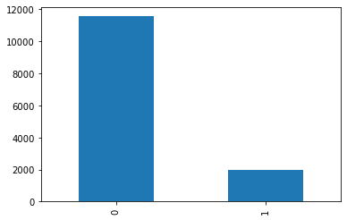
    


Option 2: fancy plot


```python
# plot response
keys, counts = np.unique(data2.response, return_counts=True)
counts_norm = counts/counts.sum()

fig = plt.figure(figsize=(8, 5)) #specify figure size
gs = gridspec.GridSpec(1, 2, width_ratios=[2,1]) #specify relative size of left and right plot

#Absolute values
ax0 = plt.subplot(gs[0])
ax0 = plt.bar(['No response', 'Response'], counts, color=['#1f77b4','#ff7f0e']) #left bar plot
ax0 = plt.title('Absolute response distribution') 
ax0 = plt.ylabel('count')
ax0 = plt.text(keys[0], counts[0]/2, counts[0]) #add text box with count of non-fraudulent cases
ax0 = plt.text(keys[1], counts[1]/2, counts[1]) #add text box with count of fraudulent cases

#Normalized values
ax1 = plt.subplot(gs[1])
ax1 = plt.bar(['Response type'], [counts_norm[0]], label='0 (no)')
ax1 = plt.bar(['Response type'], [counts_norm[1]], bottom=counts_norm[0], label='1 (yes)')
ax1 = plt.legend(bbox_to_anchor=(1, 1))
ax1 = plt.title('Relative response distribution')
ax1 = plt.ylabel('frequency')
ax1 = plt.text(['Response type'],counts_norm[0]/2, '{}%'.format((counts_norm[0]*100).round(1)))
ax1 = plt.text(['Response type'],(counts_norm[1]/2)+counts_norm[0], '{}%'.format((counts_norm[1]*100).round(1)))

plt.tight_layout()
plt.show()
```


    
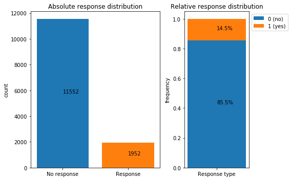
    


We observe that the "no response" cases account for 85.5% of all observations. As in Tutorial 1, we are faced with a highly imbalanced data set. This week, however, we will introduce some tools to counter the class imbalance!

#### Response type by gender

Option 1: simple Pandas plot


```python
ax = data2.groupby(['response', 'gender'])['gender'].count().unstack().plot.bar()
```


    
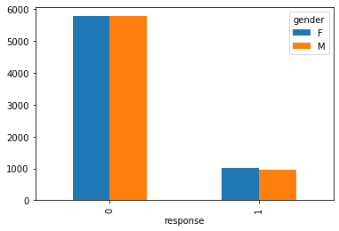
    


Option 2: fancy plot


```python
#Response type by gender
fig = plt.figure(figsize=(12, 5)) #specify figure size

#Absolute distribution
plt.subplot(1, 2, 1)
ax1 = data2.groupby(['response', 'gender'])['gender'].count().unstack().plot.bar(rot=0, ax=plt.gca(), width=0.7)
plt.title('Response by gender:\n Absolute distribution') 
#plot bar labels
for p in ax1.patches:
    ax1.annotate(str(p.get_height()), (p.get_x() + 0.1, p.get_height()/2))

#Relative distribution
plt.subplot(1, 2, 2)
ax2 = data2.groupby(['response','gender'])['gender'].size().groupby(level=0).apply(
    lambda x: 100 * x / x.sum()).unstack().plot(kind='bar',stacked=True, rot=0, ax=plt.gca())
plt.gca().yaxis.set_major_formatter(mtick.PercentFormatter())
plt.legend(bbox_to_anchor=(1, 1))
plt.title('Response by gender:\n Relative distribution') 
#plot bar labels
for p, q in zip(ax2.patches[0:2], ax2.patches[2:4]):
    ax2.annotate(str(round(p.get_height(),1)) + '%', (p.get_x()+0.2, p.get_height()/2))
    ax2.annotate(str(round(q.get_height(),1)) + '%', (q.get_x()+0.2, q.get_height()/2+p.get_height()))

plt.tight_layout()
plt.show()
```


    
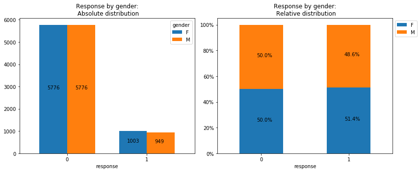
    


We observe an equal distribution in the response behavior amongst women and men.

#### Relative income distribution

Next, we plot the relative income distribution. Below an income level of 55000, we observe a relatively equal distribution of "yes" to "no" responses. **However, *all* customers with an income of 55000 or higher seem to respond to our marketing campaign!** The campaign appears to be highy affective amongst this group.


```python
ax = data2['income'].loc[data2['response'] == 0].plot.hist(bins=15, density = True, alpha=0.8, label='0 (no response)', figsize = (10,5))
ax = data2['income'].loc[data2['response'] == 1].plot.hist(bins=15, density = True, alpha=0.8, label='1 (response)', figsize = (10,5))
ax.set_xlabel('income')
ax.set_title('Relative customer income distribution by response (0/1)')
ax.legend();
```


    
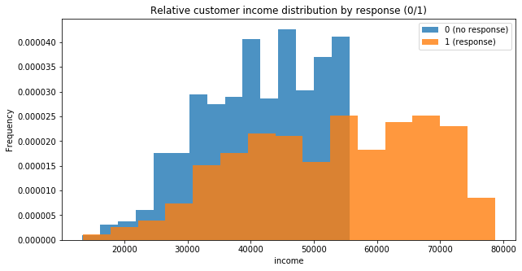
    


#### Response type by relationship status

Next, we plot the absolute and normalized responses by relationship status. We observe an equal response distribution amongst married customers ("M"), singles ("S"), and unknow ("U" aka. "it's complicated")


```python
#Response type by gender
fig = plt.figure(figsize=(12, 5)) #specify figure size

#Absolute distribution
plt.subplot(1, 2, 1)
ax1 = data2.groupby(['marital', 'response'])['response'].count().unstack().plot.bar(rot=0, ax=plt.gca(), width=0.7)
plt.title('Response by relationship status:\n Absolute distribution') 
#plot bar labels
for p in ax1.patches:
    ax1.annotate(str(p.get_height()), (p.get_x() + 0.1, p.get_height()/2))

#Relative distribution
plt.subplot(1, 2, 2)
ax2 = data2.groupby(['marital','response'])['response'].size().groupby(level=0).apply(
    lambda x: 100 * x / x.sum()).unstack().plot(kind='bar',stacked=True, rot=0, ax=plt.gca())
plt.gca().yaxis.set_major_formatter(mtick.PercentFormatter())
plt.legend(bbox_to_anchor=(1, 1))
plt.title('Response by relationship status:\n Relative distribution') 
#plot bar labels
for p, q in zip(ax2.patches[0:3], ax2.patches[3:6]):
    ax2.annotate(str(round(p.get_height(),1)) + '%', (p.get_x()+0.2, p.get_height()/2))
    ax2.annotate(str(round(q.get_height(),1)) + '%', (q.get_x()+0.2, q.get_height()/2+p.get_height()))

plt.tight_layout()
plt.show()
```


    
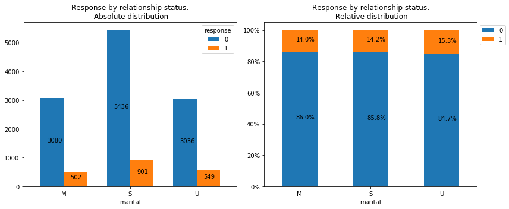
    


#### Responses by relative RFM score

Last, we plot the reponses by the customer's relative [RFM score](https://en.wikipedia.org/wiki/RFM_(customer_value)). (From Wiki:) RFM is a method used for analyzing customer value and describes three dimensions:

- Recency – How recently did the customer purchase?
- Frequency – How often do they purchase?
- Monetary Value – How much do they spend?

Plotting the RFM score as a histogram reveals how customers with a low RFM score do not respond to the campaign. Customers with a high RFM score seem to always respond. 


```python
ax = data2['rfm_score'].loc[data2['response'] == 1].plot.hist(bins=15, density = True, alpha=0.8, label='1 (response)', figsize = (10,5))
ax = data2['rfm_score'].loc[data2['response'] == 0].plot.hist(bins=15, density = True, alpha=0.8, label='0 (no response)', figsize = (10,5))
ax.set_xlabel('RFM score')
ax.set_title('Relative RFM score distribution by response (0/1)')
ax.legend();
```


    
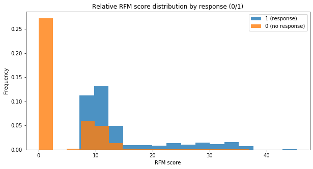
    


## 4. Data pre-processing

#### Select features and label

We store the 4 explanatory variables (`gender`, `income`, `marital` and `rfm_score`) in a new feature data frame `X`. Moreover, we store the label (`response`) in a label vector `y`:


```python
X, y = data2[['gender', 'income', 'marital', 'rfm_score']], data2['response'] #define feature matrix X and labels y
X.head()
```


<div>
<style scoped>
    .dataframe tbody tr th:only-of-type {
        vertical-align: middle;
    }

    .dataframe tbody tr th {
        vertical-align: top;
    }

    .dataframe thead th {
        text-align: right;
    }
</style>
<table border="1" class="dataframe">
  <thead>
    <tr style="text-align: right;">
      <th></th>
      <th>gender</th>
      <th>income</th>
      <th>marital</th>
      <th>rfm_score</th>
    </tr>
  </thead>
  <tbody>
    <tr>
      <th>0</th>
      <td>M</td>
      <td>13362</td>
      <td>S</td>
      <td>0.00000</td>
    </tr>
    <tr>
      <th>1</th>
      <td>M</td>
      <td>13453</td>
      <td>S</td>
      <td>0.00000</td>
    </tr>
    <tr>
      <th>2</th>
      <td>F</td>
      <td>13453</td>
      <td>U</td>
      <td>7.60233</td>
    </tr>
    <tr>
      <th>3</th>
      <td>F</td>
      <td>13453</td>
      <td>U</td>
      <td>10.14300</td>
    </tr>
    <tr>
      <th>4</th>
      <td>F</td>
      <td>13453</td>
      <td>M</td>
      <td>0.00000</td>
    </tr>
  </tbody>
</table>
</div>


#### Encode categorical variables

The variables `gender` and `marital` are categorical and require label encoding so that the models can use them. We perform one-hot-encoding using Panda's "get_dummeies()" function.


```python
X = pd.get_dummies(X, columns=["gender", "marital"], prefix=["gender", "marital"]) #we add a prefix for easier identification
X.head()
```


<div>
<style scoped>
    .dataframe tbody tr th:only-of-type {
        vertical-align: middle;
    }

    .dataframe tbody tr th {
        vertical-align: top;
    }

    .dataframe thead th {
        text-align: right;
    }
</style>
<table border="1" class="dataframe">
  <thead>
    <tr style="text-align: right;">
      <th></th>
      <th>income</th>
      <th>rfm_score</th>
      <th>gender_F</th>
      <th>gender_M</th>
      <th>marital_M</th>
      <th>marital_S</th>
      <th>marital_U</th>
    </tr>
  </thead>
  <tbody>
    <tr>
      <th>0</th>
      <td>13362</td>
      <td>0.00000</td>
      <td>0</td>
      <td>1</td>
      <td>0</td>
      <td>1</td>
      <td>0</td>
    </tr>
    <tr>
      <th>1</th>
      <td>13453</td>
      <td>0.00000</td>
      <td>0</td>
      <td>1</td>
      <td>0</td>
      <td>1</td>
      <td>0</td>
    </tr>
    <tr>
      <th>2</th>
      <td>13453</td>
      <td>7.60233</td>
      <td>1</td>
      <td>0</td>
      <td>0</td>
      <td>0</td>
      <td>1</td>
    </tr>
    <tr>
      <th>3</th>
      <td>13453</td>
      <td>10.14300</td>
      <td>1</td>
      <td>0</td>
      <td>0</td>
      <td>0</td>
      <td>1</td>
    </tr>
    <tr>
      <th>4</th>
      <td>13453</td>
      <td>0.00000</td>
      <td>1</td>
      <td>0</td>
      <td>1</td>
      <td>0</td>
      <td>0</td>
    </tr>
  </tbody>
</table>
</div>


## 5. Data split

We split the data 70:30 into a training (`data_train`) and a testing (`data_test`) partition. 


```python
X_train, X_test, y_train, y_test = train_test_split(X, y, test_size = 0.3, random_state = 42) #split data 70:30
```

We visualize the split to ensure that the distribution of "yes" to "no" responses matches the distribution in the full dataset.


```python
train_dist = y_train.value_counts() / len(y_train) #normalize absolute count values for plotting
test_dist = y_test.value_counts() / len(y_test)
data_dist = y.value_counts() / len(y)
print(train_dist)
fig, ax = plt.subplots()

ax.barh(['Test','Train','Data'], [test_dist[0], train_dist[0], data_dist[0]], color='#1f77b4', label='0 (no)')
ax.barh(['Test','Train','Data'], [test_dist[1], train_dist[1], data_dist[1]], left=[test_dist[0], train_dist[0], data_dist[0]], color='#ff7f0e', label='1 (yes)')
ax.set_title('Split visualization')
ax.legend(loc='upper left')
plt.xlabel('Proportion')
plt.ylabel('Partition')

#plot bar values
for part, a, b in zip(['Test', 'Train','Data'], [test_dist[0], train_dist[0], data_dist[0]], [test_dist[1], train_dist[1], data_dist[1]]):
    plt.text(a/2, part, str(np.round(a, 2)))
    plt.text(b/2+a, part, str(np.round(b, 2)));
```

    0    0.853047
    1    0.146953
    Name: response, dtype: float64


    

    


## 6. Data balancing

A widely adopted technique for dealing with highly unbalanced datasets is called **resampling**. It consists of removing samples from the majority class (under-sampling) and / or adding more examples from the minority class (over-sampling).


Despite the advantage of balancing classes, these techniques also have their weaknesses (there is no free lunch). The simplest implementation of over-sampling is to duplicate random records from the minority class, which can cause overfitting. In under-sampling, the simplest technique involves removing random records from the majority class, which can cause loss of information.

There are many techniques for resampling data. In this tutorial, we will use **SMOTE** (Synthetic Minority Oversampling TEchnique). It consists of synthesizing elements for the minority class, based on those that already exist. It works by randomly picking a point from the minority class and computing the k-nearest neighbors for this point. The synthetic points are added between the chosen point and its neighbors.


We'll use `ratio='minority'` to resample the minority class (1 "yes").

### Data rebalancing with SMOTE

<font color='red'>**We only rebalance the training data!**</font> The true (real-life) distribution of "no" to "yes" responses is imbalanced. The testing data has to capture the true distribution, thus it would be wrong to rebalance it. 


```python
smote = SMOTE(sampling_strategy='minority')
X_sm, y_sm = smote.fit_sample(X_train, y_train) #ONLY APPLIED TO TRAINING!!!
```

Because the dataset has many dimensions (features) and our graphs will be 2D, we will only choose the first two features (`income` and `rfm_score`) for the plots. Below we specify a generic 2D plotting function that we can call later.


```python
def plot_2d_space(X, y, label='Classes', title='x', xlabel='x', ylabel='y'):   
    colors = ['#1F77B4', '#FF7F0E']
    markers = ['o', 's']
    for l, c, m in zip(np.unique(y), colors, markers):
        plt.scatter(
            X[y==l, 0],
            X[y==l, 1],
            c=c, label=l, marker=m, s=2
        )
    plt.title(title)
    plt.xlabel(xlabel)
    plt.ylabel(ylabel)
    plt.legend(loc='upper right')
```

Then we plot the counts of "no" and "yes" responses in the original data and after applying SMOTE rebalancing. 


```python
print('Original label %s' % Counter(y_train))
print('SMOTE label %s' % Counter(y_sm))

fig = plt.figure(figsize=(15, 5)) #specify figure size

ax0 = plt.subplot(121)
ax0 = plot_2d_space(np.array(X_train), y_train, title='Imbalanced data', xlabel='income', ylabel='rfm_score')

ax1 = plt.subplot(122)
ax1 = plot_2d_space(np.array(X_sm), y_sm, title='Rebalanced data (SMOTE)', xlabel='income', ylabel='rfm_score')
```

    Original label Counter({0: 8063, 1: 1389})
    SMOTE label Counter({0: 8063, 1: 8063})


    
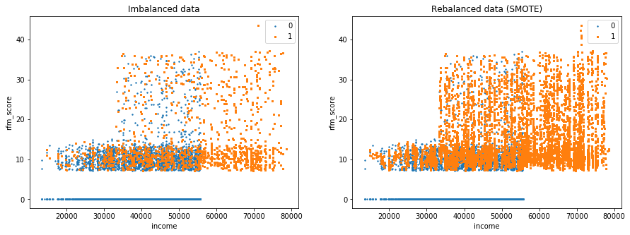
    


The number of `response` = 1 observations has significantly increased. We plot the data set distribution again to further visualize the effect of SMOTE rebalancing:


```python
train_dist = y_train.value_counts() / len(y_train) #normalize absolute count values for plotting
test_dist = y_test.value_counts() / len(y_test)
data_dist = y.value_counts() / len(y)
smote_dist = pd.Series(y_sm).value_counts() / len(pd.Series(y_sm))

fig, ax = plt.subplots()

ax.barh(['X_train (SMOTE)','Test','Train','Data'], [smote_dist[0], test_dist[0], train_dist[0], data_dist[0]], color='#1f77b4', label='0 (no)')
ax.barh(['X_train (SMOTE)','Test','Train','Data'], [smote_dist[1], test_dist[1], train_dist[1], data_dist[1]], left=[smote_dist[0], test_dist[0], train_dist[0], data_dist[0]], color='#ff7f0e', label='1 (yes)')
ax.set_title('Split visualization')
ax.legend(loc='upper left')
plt.xlabel('Proportion')
plt.ylabel('Partition')

#plot bar values
for part, a, b in zip(['X_train (SMOTE)', 'Test', 'Train','Data'], [smote_dist[0], test_dist[0], train_dist[0], data_dist[0]], [smote_dist[1], test_dist[1], train_dist[1], data_dist[1]]):
    plt.text(a/2, part, str(np.round(a, 2)))
    plt.text(b/2+a, part, str(np.round(b, 2)));
```


    
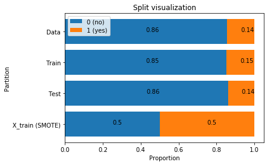
    


<font color='red'>**Note how the testing partition remains imbalanced!**</font> 

## 7. Model building

### 7.1 Logistic Regression

#### 7.1.1 Imbalanced data
To highlight the positive effect of rebalancing, we first train a model on the original, unbalanced data set. Note that this is purely for illustrative purposes and would not be done in an actual assignment.


```python
lr_imb = LogisticRegression(solver='lbfgs').fit(X_train, y_train) #define Logistic Regression classifier
```


```python
y_pred_lr_imb = lr_imb.predict(X_test)
y_predProba_lr_imb = lr_imb.predict_proba(X_test)
print ("Accuracy is: ", (accuracy_score(y_test, y_pred_lr_imb)*100).round(2))
```

    Accuracy is:  85.17


```python
y_pred_lr_imb 
y_predProba_lr_imb
```


    array([[0.95771753, 0.04228247],
           [0.86001172, 0.13998828],
           [0.87802373, 0.12197627],
           ...,
           [0.94018911, 0.05981089],
           [0.88897404, 0.11102596],
           [0.92301074, 0.07698926]])


#### 7.1.2 Balanced data (SMOTE)

Next, we train the actual Logistic Regression model (that we expect to perform somewhat well) using the rebalanced data.


```python
lr_bal = LogisticRegression(solver='lbfgs').fit(X_sm, y_sm) #define Logistic Regression classifier X_sm,y_sm 
```


```python
y_pred_lr_bal = lr_bal.predict(X_test)
y_predProba_lr_bal = lr_bal.predict_proba(X_test)
print ("Accuracy is: ", (accuracy_score(y_test, y_pred_lr_bal)*100).round(2))
```

    Accuracy is:  69.62


Note how the rebalanced data leads to a *decreased* accuracy.

### 7.2 SVM

In order to compare models, we also train another classifier using SVM.


```python
svm_bal = SVC(probability=True).fit(X_sm, y_sm)
```


```python
y_pred_svm_bal = svm_bal.predict(X_test)
y_predProba_svm_bal = svm_bal.predict_proba(X_test)
print ("Accuracy is: ", (accuracy_score(y_test, y_pred_svm_bal)*100).round(2))
```


```python
svm = svm.SVC(gamma=0.001, C=100., kernel = 'linear')
```

## Model evaluation

In this tutorial, we will use the following evaluation methods:
- Confusion matrix
- AUC (Area Under the Curve) and ROC curve
- Gains chart
- Lift chart

### Confusion matrix

(Reminder that the code below is entirely taken from sklearn).


```python
def plot_confusion_matrix(cm, classes,
                          normalize=False,
                          title='Confusion matrix',
                          cmap=plt.cm.Blues):
    """
    This function prints and plots the confusion matrix.
    Normalization can be applied by setting `normalize=True`.
    """
    if normalize:
        cm = cm.astype('float') / cm.sum(axis=1)[:, np.newaxis]
        print("Normalized confusion matrix")
    else:
       print('Confusion matrix, without normalization')

    print(cm)

    plt.imshow(cm, interpolation='nearest', cmap=cmap)
    plt.title(title)
    plt.colorbar()
    tick_marks = np.arange(len(classes))
    plt.xticks(tick_marks, classes, rotation=45)
    plt.yticks(tick_marks, classes)

    fmt = '.2f' if normalize else 'd'
    thresh = cm.max() / 2.
    for i, j in itertools.product(range(cm.shape[0]), range(cm.shape[1])):
        plt.text(j, i, format(cm[i, j], fmt),
                 horizontalalignment="center",
                 color="white" if cm[i, j] > thresh else "black")

    plt.tight_layout()
    plt.ylim([1.5, -0.5]) #added to fix a bug that causes the matrix to be squished
    plt.ylabel('True label')
    plt.xlabel('Predicted label')
```


```python
# Compute confusion matrix
class_names = ['no', 'yes']
cnf_matrix_lr_imb = confusion_matrix(y_test, y_pred_lr_imb)
cnf_matrix_lr_bal = confusion_matrix(y_test, y_pred_lr_bal)
cnf_matrix_svm = confusion_matrix(y_test, y_pred_svm_bal)

np.set_printoptions(precision=2)

plt.figure(figsize=(20, 15))

#Plot Logistic Regression (imbalanced) confusion matrix
plt.subplot(321) 
plot_confusion_matrix(cnf_matrix_lr_imb, classes=class_names,
                      title='Logistic Regression imbalanced data:\n Confusion matrix without normalization')

#Plot Logistic Regression (imbalanced) normalized confusion matrix
plt.subplot(322) 
plot_confusion_matrix(cnf_matrix_lr_imb, classes=class_names, normalize=True,
                      title='Logistic Regression imbalanced data:\n normalized confusion matrix')


#Plot Logistic Regression (balanced) confusion matrix
plt.subplot(323) 
plot_confusion_matrix(cnf_matrix_lr_bal, classes=class_names,
                      title='Logistic Regression balanced data:\n Confusion matrix without normalization')

#Plot Logistic Regression (balanced) normalized onfusion matrix
plt.subplot(324) 
plot_confusion_matrix(cnf_matrix_lr_bal, classes=class_names, normalize=True,
                      title='Logistic Regression balanced data:\n normalized confusion matrix')


#Plot SVM balanced confusion matrix
plt.subplot(325) 
plot_confusion_matrix(cnf_matrix_svm, classes=class_names,
                      title='SVM balanced data:\n Confusion matrix without normalization')

#Plot SVM balanced normalized confusion matrix
plt.subplot(326) 
plot_confusion_matrix(cnf_matrix_svm, classes=class_names, normalize=True,
                      title='SVM balanced data:\n normalized confusion matrix')

plt.show()
```

    Confusion matrix, without normalization
    [[3322  167]
     [ 434  129]]
    Normalized confusion matrix
    [[0.95 0.05]
     [0.77 0.23]]
    Confusion matrix, without normalization
    [[2343 1146]
     [  84  479]]
    Normalized confusion matrix
    [[0.67 0.33]
     [0.15 0.85]]
    Confusion matrix, without normalization
    [[3275  214]
     [ 274  289]]
    Normalized confusion matrix
    [[0.94 0.06]
     [0.49 0.51]]


    
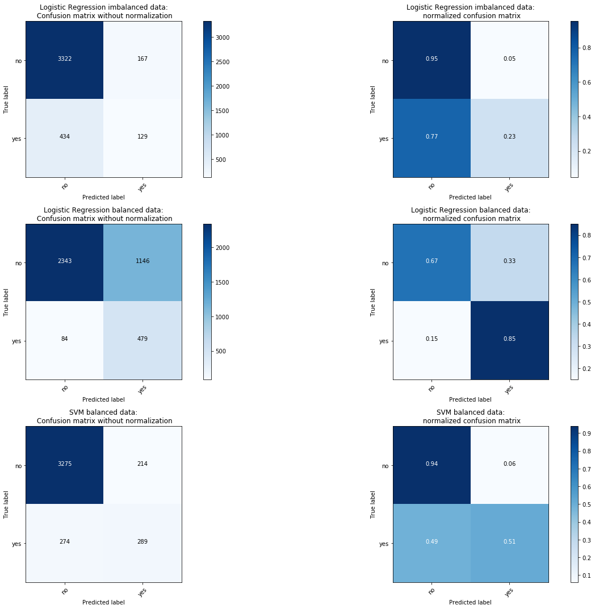
    


Observations:
1. The confusion matrix reveals how the unbalanced Logistic Regression classifier is essentially always predicting the majority class "0, no". Due to the highly imbalanced class distribution, this strategy results in a high testing accuracy of 85%. In simply terms: if the data has >85% "no" observations then always predicting "no" will result in about 85% correct "predictions". However, such a classifier has clearly not learned anything and is utterly useless in practice.
2. In contrast, the balanced Logistic Regression classifier performs much better: while it "only" identifies 67% of the "no" cases correctly, it is able to get 85% of the "yes" cases right. 
3. Lastly, the balanced SVM classifier gets 94% "no" and 51% "yes" cases right.

Which model woudl you pick?

### AUC and ROC

The area under the curve (often referred to as simply the AUC) is equal to the probability that a classifier will rank a randomly chosen positive instance higher than a randomly chosen negative one. 


```python
plt.figure(figsize=(12,10))

for test, pred, name in zip([y_test, y_test, y_test], [y_predProba_svm_bal[:,1], y_predProba_lr_imb[:,1], y_predProba_lr_bal[:,1]], ['SVM balanced (SMOTE)', 'Logistic Regression unbalanced','Logistic Regression balanced (SMOTE)']):
    fpr, tpr, _ = roc_curve(test, pred)
    roc_auc = auc(fpr, tpr)
    print(roc_auc)
    plt.plot(fpr, tpr, label='{}: AUC = {}'.format(name, round(roc_auc, 3)))
    plt.legend(loc='best')
    plt.plot([0,1],[0,1],color='black', linestyle='--')

plt.title('ROC curve (Receiver Operating Characteristic)')    
plt.ylabel('True Positive Rate (TPR)')
plt.xlabel('False Positive Rate (FPR)')

plt.show()
```

    0.7319670499570586
    0.7158494064318865
    0.8278110295386617


    
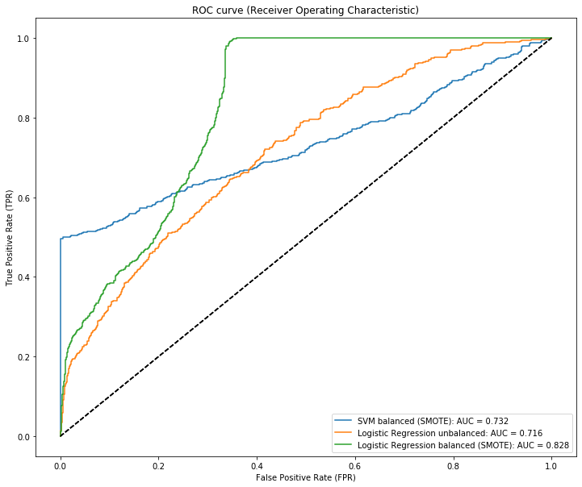
    


### Cumulative Response Curve, aka. Gains chart

From DSB1 slides:
- A Gain chart plots the **gain** (percentage of positives correctly classified by model; tp rate; hit rate) as a function of the **percentage of the population** that is targeted (decreasing by score)
- The diagonal x=y represents a random classifier; any classifier that is above the diagonal is providing some advantage

A wide gap between a random classifier (baseline) and a model indicates a high performance advantage in using said model. 

From Datacamp:
The cumulative gains graph can be used to estimate how many customers one should address to make a certain profit. Indeed, the cumulative gains graph shows which percentage of all targets is reached when addressing a certain percentage of the population.

So what does this mean?

In order to get a 80% True Positive hit rate, we would need to target ca. 30% of the population with the SVM model, and ca. 40% with the Logistic Regression model. The SVM model shows some "sweet spot" around 75% gain after which the curve becomes flatter.


```python
skplt.metrics.plot_cumulative_gain(y_test, y_predProba_lr_imb, title='Logistic Regression (unbalanced)')
skplt.metrics.plot_cumulative_gain(y_test, y_predProba_lr_bal, title='Logistic Regression (SMOTE)')
skplt.metrics.plot_cumulative_gain(y_test, y_predProba_svm_bal, title='SVM (SMOTE)');
```


    
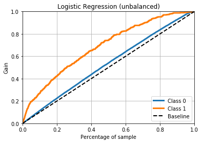
    


    
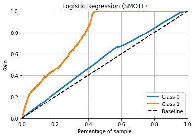
    


    
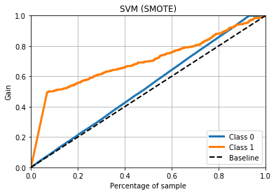
    


Which model should we choose? 
- Rebalancing clearly improves the models' performance
- still unclear wheather to choose SVM or Logistic Regression

**--> It depends on the missclassification costs whether to choose SVM or Logistic Regression.**

## Classifier evaluation with Expected Value Framework -> EXCEL

## Conclusion

In this tutorial we learned:
- how to important data and slice a subset for further analysis
- how to visualize data
- how to to rebalance imbalanced data using SMOTE oversampling
- how to train SVM and Logistic Regression models
- how to evaluate model performance using confusion matrices, AUC and ROC curves, Gain charts, and charts.
- how to compare models using the Expected Value Framework


```python

```


```python

```
